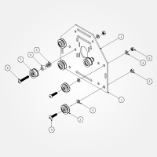
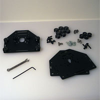
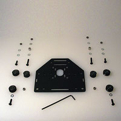
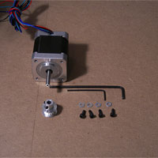
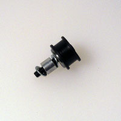
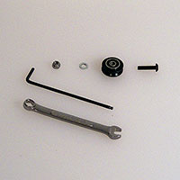
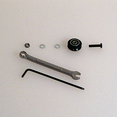
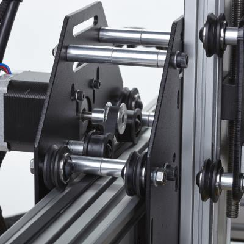
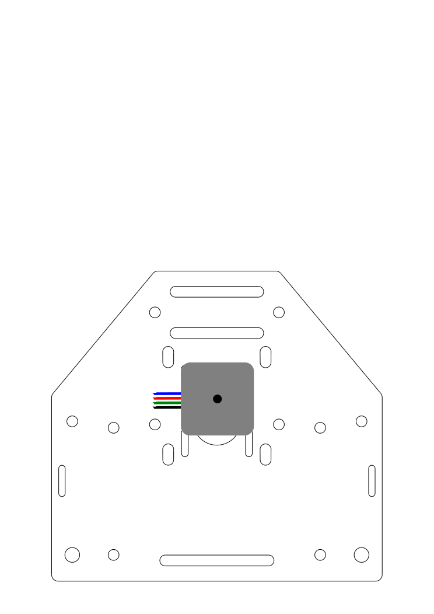

# Carriages

##Wiring options

Before beginning this section, you will have needed to select a [wiring option](http://docs.shapeoko.com/wiring.html), either one of your own devising, or one of the three options as noted below. 

* [Option \#1](wiring_1.html) (Soldering), needs no special attention at this step other than noting the motor orientations shown in the steps below.
* [Option \#2](wiring_2.html) (Terminal Blocks), if you are going to use the this method, you will need to attach those terminal blocks at the end of this step.
* [Option \#3](wiring_3.html) (Experimental!), although not necessary at this step, it could make life easier to attach your Arduino to the *right* Y axis motor mount plate.

_See those specific options for more details._

## Overview

This step is the bulk of the work required to assemble your machine. There are two different styles of plates that we will be assembling. The first style includes a stepper motor, there are 3 of these plates total, and they will be used to drive both your X- and Y-axes. The other style is nearly identical to the first, with the exception of not having a stepper motor or smooth idlers attached. This plate will be used to connect your Z-axis assembly to your X-axis assembly. 

The 3 plates with stepper motors are identical and interchangeable. The plates are symmetrical, so there is no such thing as a front and a back (as they're the same) until one determines this by attaching parts. Keep in mind that your stepper motor will go on the opposite side of your wheels and smooth idlers.

**Note:** The plates are laser-cut and powder-coated --- please examine the holes to ensure that M5 bolts and the eccentric nuts will fit --- if there are any holes with obstructions, clear these using a knife blade, round file or other tool.

It might be easier and more straight-forward to assemble all four of them to match the Z-axis motor carriage mount plate, (see the first, slightly more detailed diagram on the [Z-axis](http://docs.shapeoko.com/zaxis.html) page, [exploded view of Z Assembly Carriage](http://docs.shapeoko.com/content/tPictures/PS20021-100.svg)) then set one aside for that, and add smooth idler wheels to make the other three.

When attaching V-wheels and Smooth Idlers, push them away from the horizontal centerline of the plate (towards what will be the top of the machine for the static wheels and smooth idlers) --- this will maximize the available space and minimize the chance of the wheels slipping. Similarly, turn the eccentric nuts to move the dynamic V-wheel as far as possible from the matching static one (towards the bottom of the machine), so as to have the widest possible gap to make it easier to mount each assembly on the MakerSlide.

Note that the eccentric nuts have a centered rounded portion which mates with a matching hole on the plates --- it is that placement which allows them to function to adjust the spacing of the V-wheels.
 
##Motor Mount Carriages (PS20022) - 3 total

These are the plates that will mount on either end of the gantry and on the rear of the X-Axis.

###Requirements

####Parts

 1.  26029-01 **Motor Mount Plate** (12ga) x 3pcs
 *   30158-01 **Eccentric Nut** x 6pcs (these will be used in the larger holes at the bottom of the plates to allow for adjustment)
 *   25203-02 (from previous step) - **Dual Bearing V-Wheel** x 12pcs
 *   PS20004 **M5 x 20mm Button Head Cap Screw** x 12pcs
 *   25287-02 **M5 Flat Washer** x 36pcs
 *   25284-02 **M5 Hex Nut** x 12pcs
 *   25197-02 (from previous step) - **Smooth Idler** x 6pcs
 *   25286-05 **M5 x 30mm Button Head Cap Screw** x 6pcs
 *   25312-14 3/8" x 5/16" x #12 bore **Aluminum Spacer** x 6pcs

####Parts for attaching stepper motors

 *   **M3 x 8mm Socket Head Cap Screws (SHCS)** x 12 pcs (may vary with motor thread depth, use shorter screws (6mm) if threads bottom out, or additional washers) 
 *   **M3 Flat Washer** x 12 pcs
 *   **GT2 pulley** x 3 pcs (note that the set screw end goes on first and the pulley must align with the Smooth Idler Wheels)

####Tools

 * 3mm Hex Key
 * 2.5mm Hex Key (used for the M3 screws if attaching the motor)
 * 1.5mm Hex Key (used for the set screws in the pulley)
 * 8mm (5/16") wrench

1. Connect V-Wheels (**\#3**) to the plate (**\#1**)
	- two static at the top (using M5 Hex Nuts (**\#6**))
	- two eccentric at the bottom in the larger holes (using Eccentric Nuts (**\#2**)) --- note that the eccentric nuts have a round portion which should fit completely into these holes --- ensure that the nuts are inserted evenly and squarely and not canted at an angle.
2. Connect the smooth idlers (**\#7**) to plate
	- two total, these will need an aluminum spacer (**\#9**) (**Note:** You should sandwich the spacer in between the two washers (**\#5**), for the sake of symmetry and to ensure the bearings rotate freely.)
	- take note of the orientation of the bolt (**\#4**)
	- take note of the orientation of the bearings/idler (the plastic part is away from the carriage plate, while the metal bearing is to the plate --- in theory, it would have been possible to have foregone the idler sub-assembly and instead: a. place the smooth idler onto the bolt/bearings, b. place a bearing onto the bolt on top of the smooth idler, c. place a precision shim washer onto the bearing, d. add the second bearing, e. add a washer, the spacer and another washer before placing the bolt and its sub-assembly into the proper hole, then adding the final washer and nut on the other side)
3. Attach your stepper motor - suggested orientations are shown at the bottom of this page
	- Attach the GT2 pulley (it is easier to attach the pulley before mounting the motor.)
	- Use four M3 SHCS and four M3 flat washers to attach each stepper motor (**Note:** You may need more than one washer per bolt, depending upon the depth of the threads in the motor and the length of your bolt (6mm was initially specced, 8mm is shipping in current kits). Use an equal number of washers per motor. Be careful not to strip out the threads in the motor.) When you tighten the motor into place, do so in an X pattern. You want the face of the motor to be equally tight against the plate.

Please note that the above photograph does not show the stepper motor in place. As previously noted, one should attach at least the stepper motor for the X-axis plate, as it's difficult to attach it once the gantry carriage is assembled. If using [Wiring Option \#2](http://docs.shapeoko.com/wiring_2.html), attach the terminal blocks now to the appropriate plates, while the inner sides are readily accessible.

Motor orientation is as follows:

###Left Y-axis and X-axis

(If using [wiring option \#2](http://docs.shapeoko.com/wiring_2.html), attach one terminal block to the right of the X-axis plate)

###Right Y-axis

(If using [wiring option \#2](http://docs.shapeoko.com/wiring_2.html), attach two terminal blocks to this plate)

###Next step [Z-axis](http://docs.shapeoko.com/zaxis.html)

To express concerns, post on the [forums](http://www.shapeoko.com/forum/index.php), to suggest improvements without using github, edit [this wiki page](http://www.shapeoko.com/wiki/index.php?title=Carriages_2&action=edit&redlink=1).
