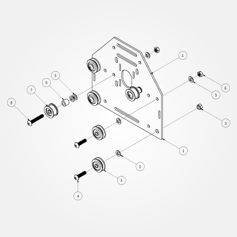

# Carriages

##Wiring options

Before beginning this section, please take a look at the wiring options page. 

* [Option \#1](wiring_1.html), needs no special attention at this step other than noting the motor orientations show in the steps below.
* If you are going to use the terminal block method [option \#2](wiring_2.html), you will need to attach those terminal block in this step.
* [Option \#3](wiring_3.html), although not necessary at this step, could make life easier to attach your Arduino to the *right* Y axis motor mount plate.

_See those specific options for more details._

## Overview

This step is the bulk of the work required to assemble your machine. There are two different styles of plates that we will be assembling in this step. The first style includes a stepper motor, there are 3 of these plates total, and they will be used to drive both your X- and Y-axes. The other style is nearly identical to the first, with the exception of not having a stepper motor or smooth idlers attached. This plate will be used to connect your Z-axis assembly to your X-axis assembly. 

The 3 plates with stepper motors are identical and interchangeable. The plates are symmetrical, so there is no such thing as a front and a back (as they're the same) until one determines this by attaching parts. Keep in mind that your stepper motor will go on the opposite side of your wheels and smooth idlers.

**Note:** The plates are laser-cut and powder-coated --- please examine the holes to ensure that M5 bolts and the eccentric nuts will fit --- if there are any holes with obstructions, clear these using a knife blade, round file or other tool.

It might be easier and more straight-forward to assemble all four of them to match the Z-axis motor carriage mount plate, then set one aside for that, and add smooth idler wheels to make the other three.

 
 
##Motor Mount Carriages (PS20022) - 3 total

###Requirements

####Parts

 1.   **Motor Mount Plate** (12ga) (26029-01) x 3pcs
 *   **Eccentric Nut** (30158-01) x 6pcs
 *   (from previous step) - **Dual Bearing V-Wheel** (25203-02) x 12pcs
 *   **M5 x 20mm Button Head Cap Screw** (PS20004) x 12pcs
 *   **M5 Flat Washer** (25287-02) x 36pcs
 *   **M5 Hex Nut** (25284-02) x 12pcs
 *   (from previous step) - **Smooth Idler** (25197-02) x 6pcs
 *   **M5 x 30mm Button Head Cap Screw** (25286-05) x 6pcs
 *   3/8" x 5/16" x #12 bore **Aluminum Spacer** (25312-14) x 6pcs

####Parts for attaching stepper motors
 *   M3 SHCS x 12 pcs
 *   M3 Flat Washer x 12 pcs
 *   GT2 pulley

####Tools

 * 3mm Hex Key
 * 2.5mm Hex Key (used for the M3 screws if attaching the motor)
 * 1.5mm Hex Key (used for the set screws in the pulley)
 * 8mm (5/16") wrench

These are the plates that will mount on either end of the gantry and on the rear of the X-Axis.

1. Connect V-Wheels to the plate
	- two static at the top (using M5 Hex Nuts)
	- two eccentric at the bottom in the larger holes (using Eccentric Nuts)
2. Connect the smooth idlers to plate
	- two total, these will need an aluminum spacer (**Note:** You may want to sandwich the spacer in between two washers, rather than placing both washers against the plate as shown.)
	- take note of the orientation of the bolt
	- take note of the orientation of the bearings/idler
3. Attach your stepper motor
	- Using 4 x M3x6mm SHCS, attach the stepper motor
	- Use an M3 washer between the SHCS and the plate (**Note:** You may need more than one per washer, depending upon bolt length and the depth of the threads in the motor. Use an equal number of washers per motor. Be careful not to strip out the threads in the motor.) When you tighten the motor into place, do so in an X pattern. You want the face of the motor to be equally tight against the plate.

Please note that the above image does not show the stepper motor in place. As previously noted, one should attach at least one stepper motor for the X-axis plate, as it's difficult to attach it once the gantry carriage is assembled. Use 4 M3 screws, 4 M3 washers and also attach the GT2 pulley.

Motor orientation is as follows

###Left Y axis and X Axis

###Right Y axis

