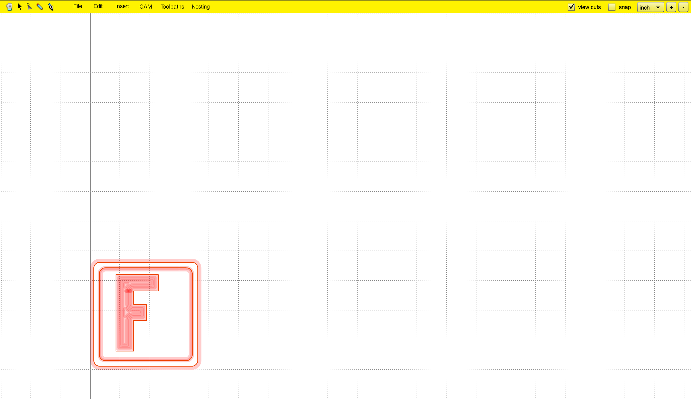
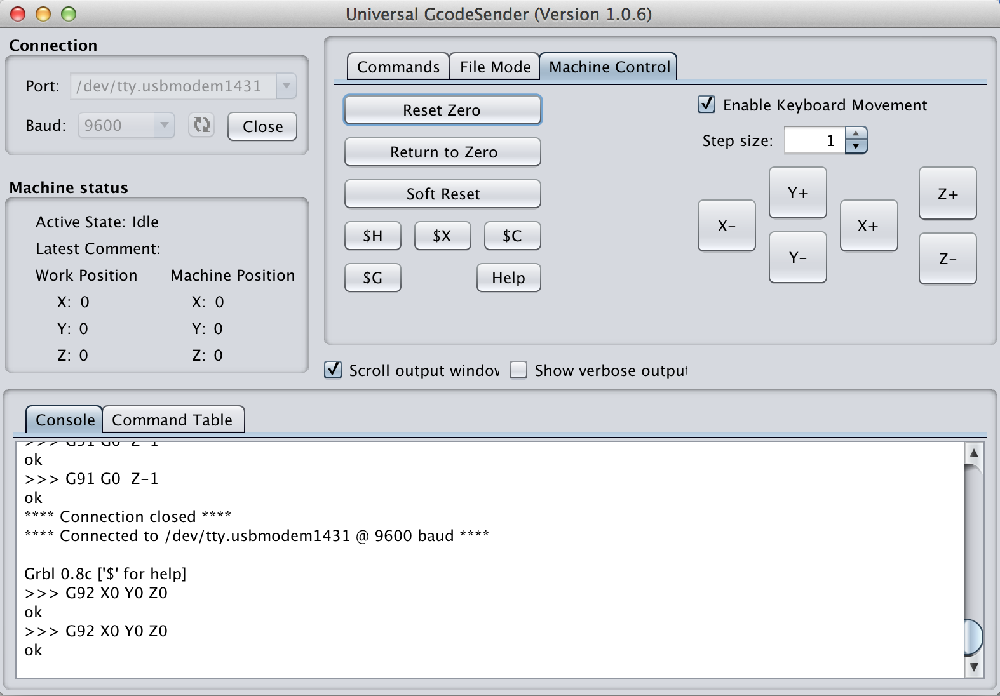
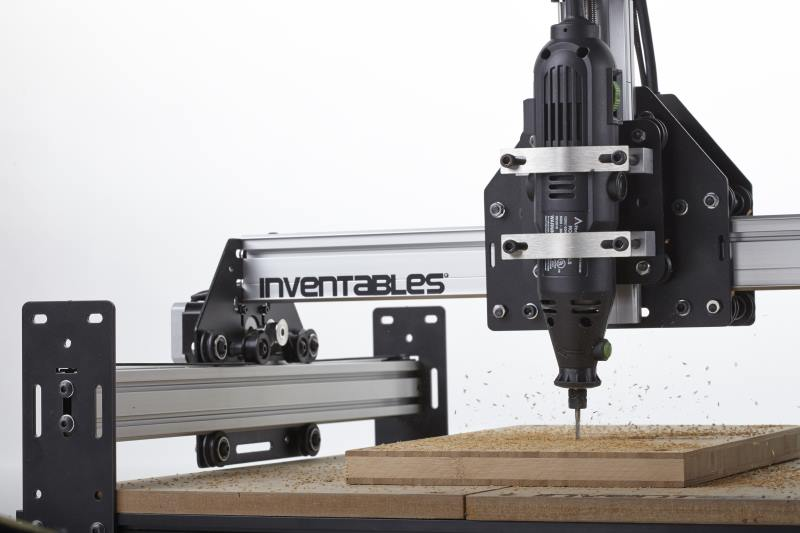
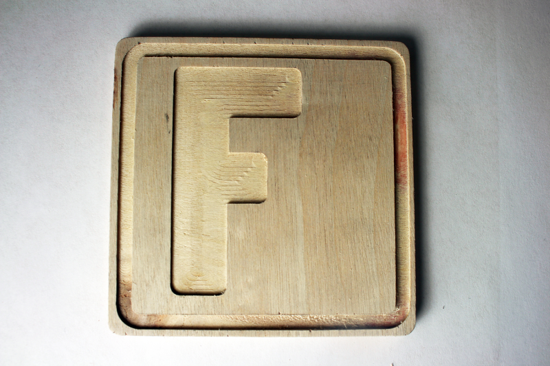

#Getting Started

Welcome to Your New Life! After completing this step, you'll be a pro! OK, maybe not a pro, but you will be capable of designing a simple part, generating appropriate toolpaths, and cutting said toolpaths on your Shapeoko 2. This is exciting, get ready!

Our first job will be to design and cut a coaster out of some suitable material --- cork is one good choice, and the feed and plunge rates below assume that. You can purchase cork from [inventables.com](https://www.inventables.com/categories/materials/cork) or a craft or office supply store.

##Find the Origin

Step #1: Open [makerCAM.com](http://www.makercam.com) (you'll need to have Adobe Flash installed, if you don't, install it from [adobe.com](http://www.adobe.com/support/flashplayer/downloads.html). Zoom out until you can see the origin. The origin is 0,0 in the cartesian coordinate system, it's where the X and Y axis meet. In the CAM world, the origin is where your machine is going to start from.

##Create a Rectangle

Select Insert -> Rounded Rectangle. When the dialog box comes up, input 3.5 (inches) for both the length and width. leave the radius as 0.2. Click OK. You now have a rounded rectangle!

##Another Rectangle

Select Insert -> Rounded Rectangle. When the dialog box comes up, input 3.125 for both the length and width. leave the radius as 0.2. Click OK. You now have another rounded rectangle! If necessary, move the rounded rectangle so the smaller one is inside of the bigger rectangle. Like this:

##Draw Freehand

Select the pencil tool from the toolbar in the top left corner of the screen. Use it to draw the first letter of your last name. Draw it in block style. It might take a few tries. If you mess up, switch to the pointer tool, select your line and press 'delete' on your keyboard. Once you have a rough shape of your letter, take a step back and have a look. A little rough isn't it? That's OK, it's a start!

#Prettify Your Freehand

Take the pointer tool with the circle on the end, and start working your letter into shape. Zoom in, and hover over one of the corners. See the red dot? Now you can click and drag that red dot until your line is straight (or in the shape you want it). If you put that red dot onto another one, it will join the two lines together. Now we're getting somewhere! 

If necessary, draw a second path (and if need be a third) for a counter (if you've drawn an A, B, D, O, P, Q, or R).

Once you're happy with the letter, go ahead and center it inside the rectangles.

##Engrave Your Letter

Click on the solid black arrow in the toolbar (in-between the hand and the node-editor (arrow w/ a circle at the tip). Select all the path(s) which make up your letter with the pointer tool. Once it's selected, the border will turn red (may seem orange on some displays). Now, take a deep breath, we're going to make our first toolpath! Click CAM -> Pocket. Fill in the following values then click OK:

    Name:                letter_pocket
    Tool Diameter:       0.125
    Target Depth:        -0.03125
    Safety Height:       0.25
    Stock Surface:       0
    Step Over:           40
    Step Down:           0.3125
    Roughing Clearance:  0
    Feed Rate:           30
    Plunge Rate:         10
    Direction:           Counter Clockwise

(Please note that the Feed (30) and Plunge (10) rates are set for cork --- if you are using some other material for your coaster, please select an appropriate value from the [Feeds and Speeds page](http://www.shapeoko.com/wiki/index.php/Materials) on the wiki.)

Your letter should look like it's filled in with a hatch pattern.

##Engrave the Border

Select the inside rounded rectangle (the second one we made). Click CAM -> Follow Path Operation. Fill in the following values, then click OK:

    Name:                trim_engrave
    Tool Diameter:       0.125
    Target Depth:        -0.03125
    Safety Height:       0.25
    Stock Surface:       0
    Step Down:           0.3125
    Feed Rate:           30
    Plunge Rate:         10
    Direction:           Counter
  
Your line will be highlighted yellow.

##Create a Profile

Select the outside rounded rectangle (the first one we made). Click CAM -> Profile Operation. Fill in the following values, then click OK:

    Name:                coaster_cut_out
    Tool Diameter:       0.125
    Target Depth:        -0.26
    Inside/outside:      Outside
    Safety Height:       0.25
    Stock Surface:       0
    Step Down:           0.3125
    Roughing Clearance:  0
    Feed Rate:           30
    Plunge Rate:         10
    Direction:           Clockwise

Please adjust the value for Target Depth to be equal to the thickness of the material which you have selected for your coaster.

##Position Coaster at Origin

In makerCAM, position your coaster just off of the origin point.

##Generate G-Code

It's time to generate your G-code! If you check the "view cuts" option in the top right portion of the screen, your toolpaths will be filled with nice colors representing the operations. If everything looks OK, go ahead and click CAM -> calculate all. Nice work.

##Export G-Code

Export Your g-code! Your coaster should look a little goofy right now, with colors and curves representing the toolpaths. That's OK, imagine those toolpaths as a map for your bit to follow. Once you have calculated all toolpaths, let's go ahead an export the file. Click CAM -> export g-code. A couple of things to remember on this screen.

    The order should go:
    letter_pocket
    trim_engrave
    coaster_cutout

As long as that's OK, then click 'all' (will highlight all of your operations), then click "Export Selected Toolpaths". A file dialog box will prompt your for a location to save your file. let's name it 'monogram_coaster.nc' and save it somewhere that you will remember. After the file is exported (it'll only take a split second), go ahead and save the svg file from makerCAM. Click file -> save SVG. Save it somewhere that you will remember. 

##Open Software
Just like we did in the Hello World section, plug the power in to your machine and open Universal Gcode Sender on your computer. Once the program has loaded, plug in the USB cord to your computer and you should hear the stepper motors engage.

If Java isn't an option for you, you may use some other [communication/control program](http://www.shapeoko.com/wiki/index.php/Communication_/_Control).

##Open Connection Between Computer and Machine

Select the correct com port and baud rate from the drop down menus on the left.  Click 'Open' to establish a connection with the Arduino.  GRBL says hello by displaying its version number.

##Open File

Browse for the file you just exported from makerCAM.

##Verify File

Click the visualize button, located just below the browse button, to see what the file will look like. After a few seconds, a screen similar to the one below will display, which you can interact with by left clicking and dragging your mouse around.

If you aren't using a control program with a visualizer, you should find one and use it. There is a list of open source previewers on the wiki in the [software section](http://www.shapeoko.com/wiki/index.php/Previewing_G-Code). Alternately, you could use the on-line previewer [gview at buildlog.net](http://www.buildlog.net/gview/) --- [gview tutorial on the wiki](http://www.shapeoko.com/wiki/index.php/Gview_tutorial).

##Set Zero Position

If your file visualization looks correct, close the visualizer and click the 'machine control' tab towards the top of the window.

Jog your machine to the lower left side of your work surface using the different axis control buttons. Click the 'Reset Zero' button to tell your machine that you are at 0,0. You should notice on the left of the panel your work position coordinates will be set to X:0, Y:0, Z:0

**Note:** This assumes that one has mounted a spindle and secured an appropriate end mill (any straight end mill will work, 1, 2 or 4 flutes will be fine). See the documentation for the rotary tool for the details on how to use a collet and how to tighten it.  Make certain the bit is securely held by the collet, per the instructions for your spindle. If necessary, use a bit of plumber's silicon thread tape on the collet of your rotary tool to ensure this.

Mounting the spindle should be straight-forward, but the Altocraft rotary tool currently bundled with the ShapeOko 2 is asymmetric (narrower at the bottom than at the top) and will mount at a slight angle. This can be ameliorated by wrapping a reasonably large/thick zip tie around the narrower bottom portion of the tool and positioning that under the lower universal spindle mount when mounting the tool. Doing so will result in better, more perpendicular cuts. One should probably find or design and cut a custom mount out of HDPE or UHMW or Delrin or some other appropriate material (see [Spindle Options](http://www.shapeoko.com/wiki/index.php/Spindle_Options) on the wiki. 

##Air Cut

Just to make sure, lets draw this in the air.  Click the 'File Mode' tab at the top of the program window. With the spindle ~1" above the work surface, click the 'Send' button just below the file path.

You should see Universal Gcode Sender start streaming the file, and your machine should start moving around.

##Run Job!

First, make sure that you have adequate safety gear, eye protection (safety glasses), hearing protection (at least a pair of foam ear plugs, better is to combine foam ear plugs with noise-reducing ear muffs). Second, review the [operating checklist](http://www.shapeoko.com/wiki/index.php/Operating_Checklist). Third, **never** operate the machine without safety gear. 

1. Cut 4 pieces of double sided tape that are approximately 2" long each. Stick those pieces around the perimeter of your wood. Make sure they're on there nice and tight!
2. Move your machine all the way to the front/left corner of the work area. If the machine is off, you can just grab the spindle and pull it over into position. Take note of roughly where that location is. OK, now move the spindle out of the way.
3. Stick your piece of material down onto the waste board. Give it a nice firm press to make sure it's going to stay. The last thing we want is for the material get thrown out of the machine and hit you in the face!
4. Move your machine back to the position you noted earlier. Keep in mind that it doesn't need to be in the *exact* same place, we're just putting it in the front/left corner. This is going to be our 0,0 position.

5. Lower your Z-axis so the tip of the end mill mounted in the spindle *just* ***touching*** the material. A good way to gauge is to lower it down onto a single sheet of paper. As the bit gets close to the paper, try moving the paper around slightly. When the bit prevents the paper from moving, then you're at the right height! This also usually works out to leaving a paper-thin thickness connecting the cut-out part to the balance of the material. 

OK, here we go. Take a deep breath and click the 'Send' button.

If things work out well your coaster should be held in place by the paper-thin thickness of cork mentioned above. If not, once the machine has been moved out of the way and the spindle has been turned off and completely stopped spinning, use a suitable tool to cut it free and remove the balance of the material from the work area.

If you have any difficulties see [Operation Troubleshooting](http://www.shapeoko.com/wiki/index.php/Operation_Troubleshooting). See also [Fine Tuning](www.shapeoko.com/wiki/index.php/Tuning).

MakerCAM has some on-line pages for the original version of this [tutorial](http://www.makercam.com/tutorial.html) (which has some interesting additional commentary) as well as a [help page](http://www.makercam.com/help.html), and more information is available [on the wiki](http://www.shapeoko.com/wiki/index.php/MakerCAM).

To express concerns, post on the [forums](http://www.shapeoko.com/forum/index.php), to suggest improvements without using github, edit [this wiki page](http://www.shapeoko.com/wiki/index.php?title=Firstjob_1&action=edit&redlink=1).
