# Gantry

**Note:** The two pieces of MakerSlide used in these steps must have threads in them, cut by tapping. If you have not yet finished tapping at least two pieces MakerSlide, you can put this off no longer.

**Further note:** Also, compare all of your pieces of Makerslide --- use the two which are the most equal in length and cut the most evenly / squarely for the X-axis gantry. The Y-axis can be left a bit off at the back end if need be w/o affecting the machine's operation or squareness.

## Belt Clip Assembly (PS20020)

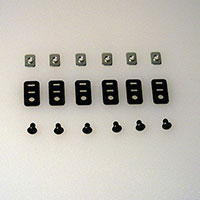
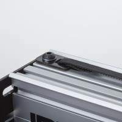

1. PS20003 **M5 x 8mm, BHCS** x 1 pcs.
- 26016-01 **M5 insertion nut** x 1 pcs.
- 26051-01 **Fiberglass Clip** x 1 pcs.

The Belt Clip Assemblies are used to fasten and tension the GT2 belts (this is detailed later). There are 6 total, which should be assembled at this point, and which should be placed in the MakerSlide slots during assembly. See the [PS20025 diagram](/content/tPictures/PS20025_16.png) below for details on orientation. Test for fit into the MakerSlide after assembling the first one, if they don't fit, remove the insertion nut and flip it over. At a minimum you just need to remember to put the insertion nuts into the back piece of MakerSlide (on the top slot) before attaching the second motor mount carriage (it is possible to assemble the belt anchor with the insertion nut in the MakerSlide). Once the carriage is in place, you will no longer have access to the slot. **Note** the clips may have loose splinters along the cut edges --- carefully buff any such off with a paper towel (and promptly dispose of the towel to avoid splinters).

##Sub Gantry (PS20023)

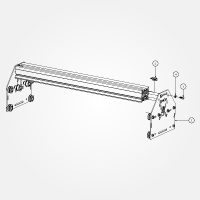 
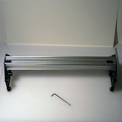
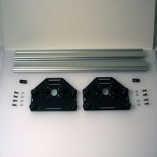
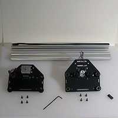

###Requirements

####Parts

1. PS20022 **Motor Mount Carriage** x 2 pcs.
- PS20020 **Belt Clip Assembly** x 2 pcs.
- 25286-02 **M5 x 12mm, BHCS** x 8 pcs.
- 25287-02 **M5 Flat Washer** x 8 pcs.
- PS20008 X/Y Axis Rail **MakerSlide Extrusion 500mm** x 2 pcs. (Please note that all holes on the remaining MakerSlide must be tapped with M5x0.8 threads)

**Note:** Do not attach one end plate during this step (despite the photograph showing this), you must slide the Z-Axis Assembly gantry carriage (PS20031) from the previous step onto the gantry (see below) before attaching the second motor mount plate.

This is evident in the next step.

**Note:** The diagram shows the assembly from the rear. The light grey end plate is not to be attached as-of-yet.

The Y-axis motors should turn in different directions --- the one which is for the right side of the gantry should turn clockwise, the one for the left should turn counter-clockwise.

Place the first piece of MakerSlide (**\#5**) against a Motor Mount Carriage (**\#1**). Place a washer (**\#4**) onto an M5 BHCS (**\#3**) and screw it into one of the holes which you have tapped into the MakerSlide. Repeat for the other hole. Make note of the orientation of the V-rails on the MakerSlide as shown in the diagram, add the second piece of MakerSlide so that the V-rails are opposite from each other, on the outside.

Push the rear piece of MakerSlide as far as is possible to the back end of the slot which the 12mm M5 bolts fit through. Only tighten the pair of bolts on the MakerSlide which is snugged up against the end of the slot, ensuring that the first piece of Makerslide is plumb and square to the plate, the other should be slightly loose. Note that there is a space in-between the two pieces of MakerSlide. This spacing will be set in a following step.

Place two belt anchors in the top channel of what will be the rear piece of MakerSlide (or at least two insertion nuts) as shown in the diagram.

##Complete Gantry (PS20025)

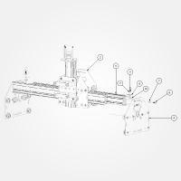
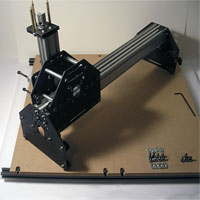
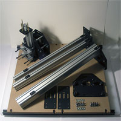 
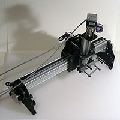
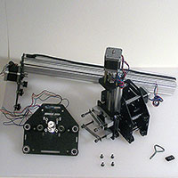

**Note:** the parts picture above shows some extra parts which will be used in the next step.

###Requirements

####Parts

1. (un-enumerated part)
2. PS20031 **Gantry Carriage** x 1 pcs.
3. PS20008 X/Y Axis Rail - **MakerSlide Extrusion - 500mm** x 2 pcs.
4. PS20022 **Motor Mount Carriage** x 2 pcs.
5. (un-enumerated part)
6. 25286-02 **M5 x 12mm, BHCS** x 8 pcs.
7. 25287-02 **M5 Flat Washer** x 8 pcs. (10 if adding an M5 washer to each belt clip anchor as shown in the diagram)
8. 26051-01 fiberglass in-line belt clip (these are part of PS20020 below) x 2 pcs.
9. PS20003 M5 x 08mm, BHCS (these are part of PS20020 below) x 2 pcs.
10. 26016-01 M5 insertion nut (these are part of PS20020 below) x 2 pcs.
11. PS20020 **Belt Clip Assembly** x 2 pcs. (called out as individual parts #7--10)

(Note: the diagram shows an M5 washer being added to each belt clip anchor --- this is optional, and may make it more difficult to assemble the belt clip anchor)

The gantry has a space between the rails, rather than try to set it mechanically, we allow the Z-axis Gantry Carriage to establish it.

Turn the eccentric nuts on the V-wheels on the Gantry Carriage (**\#2**) so that they are as far from the static V-wheels as is possible. Carefully roll the Gantry Carriage onto the two pieces of MakerSlide (**\#3**) of the Sub Gantry (sub-assembly from above, **\#3** and **\#4** ), facing the spindle carriage away from the MakerSlide which is bolted in place at the extreme edge of the slot. Move the Gantry Carriage as close to the attached Motor Mount Carriage Plate (**\#4**) as is possible, setting the spacing at this end, tighten the bolts for the loose MakerSlide (push down on the gantry carriage when tightening the top bolts, pull up on it when tightening the bottom bolts). Attach the other Motor Mount Carriage in the same fashion, ensuring that the spacing is consistent, pushing down on the MakerSlide to ensure that the two plates are square (make certain that a pair of Belt Anchor Clips is in the Makerslide before doing so). Ensure that the Gantry moves smoothly for the entire length of the X-axis. If necessary, loosen the M5 bolts and adjust the fit until everything is square and aligned and the gantry carriage travels smoothly --- check that the Delrin V-wheels are riding evenly on the V-rails at the top and bottom --- if they are not, then loosen rails, then tighten the eccentric nuts to bring the rails to the center of the V-wheels. Then tighten that end of the machine. Move the gantry to the other side to force that to the correct position and repeat. If necessary, loosen the V-wheels and then re-adjust as needed. One may make further adjustments as described in the final step, [Work Area](/#workarea).

[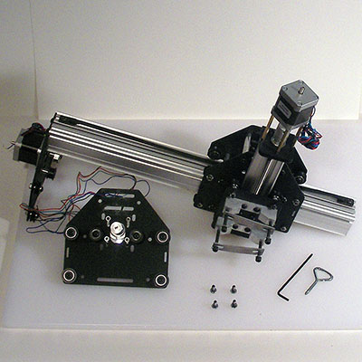](content/tPictures/so_gantry_half_carriage_mounted_tools_8.jpg)

[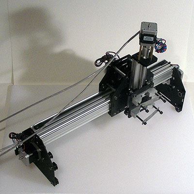](content/tPictures/so_gantry_assembled_wired_8.jpg)

###Next step [Y-axis](/#yaxis)

To express concerns, post on the [forums](http://www.shapeoko.com/forum/index.php), to suggest improvements without using github, edit [this wiki page](http://www.shapeoko.com/wiki/index.php?title=Gantry_2&action=edit&redlink=1).
