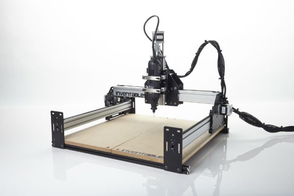
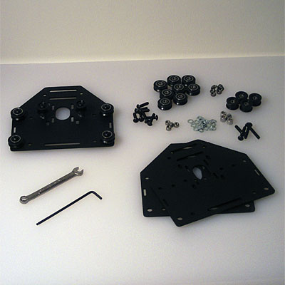
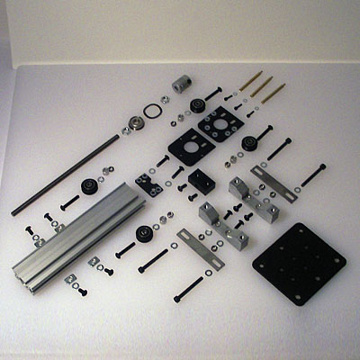
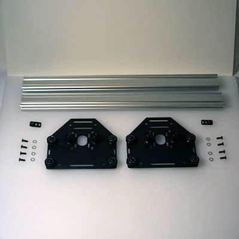
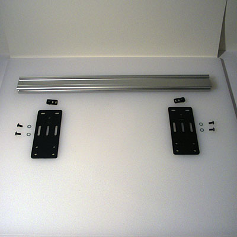
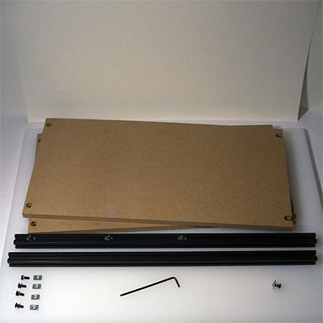
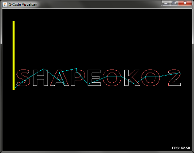

#Assembly Overview

##Welcome!

Thank you for supporting Project Shapeoko, an opensource CNC machine which may be used for milling, lasercutting, 3D printing, cutting fabric, etc. The work area is approximately 12" x 12" x 2.5" (but can be [enlarged](http://www.shapeoko.com/wiki/index.php/Scaling_Up), and the Z-axis can easily be extended to ~3.5", or more by replacing the MakerSlide and threaded rod) and precision is dependent upon the belts, pulleys, motors and electronics which are selected (for the default SO2, that is 1/40th of a mm along X and Y, 1/320th of a mm along Z ([ShapeOko 2 Grbl Configuration page](http://www.shapeoko.com/wiki/index.php/Grbl_Configuration)). ShapeOko is named after the **Shape**ways 3D printing and the Pon**oko** laser cutting services and was initially launched on [Kickstarter](http://www.kickstarter.com/projects/edwardrford/project-shapeoko-a-300-complete-cnc-machine?ref=live).

The following pages are filled with the information you need to assemble your Shapeoko 2 desktop CNC machine. Please read through them in advance, and make note of things to check and verify before beginning assembly. If you have any difficulties with assembly, please check the ShapeOko [wiki](http://www.shapeoko.com/wiki) and [forums](http://www.shapeoko.com/forum/index.php). **Please note** that there is a page on [assembly troubleshooting](http://www.shapeoko.com/wiki/index.php/Assembly_troubleshooting) on the wiki.

###A note on diagrams

Where possible, diagrams and illustrations are linked to larger versions which should fill your browser window. Most of the parts diagrams are in SVG format which will allow you to magnify them if using a tablet which supports such. When the SVG diagrams are opened in a browser window, they are interactive --- clicking on the parts list text will highlight the matching part(s) in the diagram). Please note that each SVG diagram comes in two versions, one intended for viewing *in situ* at a typical size, the other, with a suffix of "-100" which is set to fill a browser window --- each image's link is of course to that latter version.

Please refer to the ShapeOko [wiki](http://www.shapeoko.com/wiki) for additional information on using or upgrading your machine.

###A note on safety

_Never operate the machine without adequate safety gear for the current task. Never reach into the machine's operating envelope while it is running. Always have a means of safely disabling the machine's motion and spindle. Never leave the machine operating un-attended. There is an [operating checklist](http://www.shapeoko.com/wiki/index.php/Operating\_Checklist) which should always be followed._

###Overview

1. Review the parts in your kit and the instructions
2. Read the [Pro Tips](tips.html) and make sure you have all the required [Tools](tips.html#Tools)
3. Install your [Software](software.html)
4. Test Your [Electronics](electronics.html)
5. Review the [Wiring Options](wiring.html)
6. Assemble your machine ([Wheels](wheels.html), [Carriages](carriages.html), [Z-axis](zaxis.html), [Gantry](gantry.html), [Y-axis](yaxis.html), [Work Area](workarea.html), and [Electrical Wiring](wiring.html))
7. Run [Hello, World!](helloworld.html)
8. Run your [First Job!](firstjob.html)

###Contributing

If you are interested in contributing to the docs pages, please see [this page](contribute.html) for information on how to get started.

##Assembly Steps

The first thing to do is to compare what you have received with the inventory sheet included with your kit. For reference, there is also a [B.O.M. (Bill of Materials) with sortable columns and (some) options on the wiki](http://www.shapeoko.com/wiki/index.php/BOM). Please note that part specifications / sizes may change with different kit batches, especially for aspects which do not affect functionality and fit. Also, any bags which don't have a part number and quantity should be sorted out and matched against the B.O.M. and [parts pages](http://www.shapeoko.com/wiki/index.php/Parts). Please compare one part to another (especially the MakerSlide) and check the instructions for specific things to check. If anything in your kit is missing or damaged after your initial review, contact [Inventables Customer Service](https://www.inventables.com/about): [help@inventables.com](mailto:help@inventables.com) to make arrangements all-at-once for everything, so that one doesn't have to wait on multiple shipments.

If your electronics vary in any fashion from the standard parts, it is your responsibility to ensure that one doesn't damage the electronics. Please review the [Parts page on the wiki](http://www.shapeoko.com/wiki/index.php/Parts) and any other relevant documentation which is necessary for the parts which you have sourced.

##Software
[Goto the Instructions](software.html)

Before we can control our machine, we need to install and/or configure some software. If you're going to test your electronics, then you'll need to have this step done before you can complete that step. Otherwise, you'll need to complete this step before running Hello, World. 

---

##Electronics
[Goto the Instructions](electronics.html)

In this step, we will *test* our electronics setup. It's beneficial to do this prior to assembling the machine, as some issues are more easily addressed before assembly takes place. If a problem were to occur, it's much easier to troubleshoot without having to disassemble the machine!

---

##V-Wheels and Idlers
[Goto the Instructions](wheels.html)

A lot of the "work" required to assemble the machine is done in this step. It's not hard work, but it'll take a while. Just like long division.

---

##Carriages
[Goto the Instructions](carriages.html)

This is the most labor intensive part of the assembly. You will be assembling 3 motor mount plates. Please note that before finishing this step you must decide which wiring option you will use.

---

##Z-Axis
[Goto the Instructions](zaxis.html)

The Z-axis is comprised of 3 separate assemblies, and will require some time (and patience) to fully assemble. It will also require that you have begun tapping the MakerSlide (see the [Pro Tips](tips.html)). Once you are done with this step, your machine will really start to take shape. 

---

##Gantry
[Goto the Instructions](gantry.html)

The gantry continues the process of taking assemblies and combining them. You will have needed to finish tapping two pieces of MakerSlide before beginning this step.

---

##Y-Axis
[Goto the Instructions](yaxis.html)

The Y-axis makes up the frame of the machine along with the last component in the next step. You will have needed to finish tapping the last two pieces of MakerSlide before beginning this step.

---

##Work Area##
[Goto the Instructions](workarea.html)

The work area integrates the last component with the previous assemblies, completing the mechanicals of the machine.

---

##Electrical Wiring##
[Goto the Instructions](wiring.html)

The machine is complete when the electronics are wired up to the motors and the belts are installed, allowing movement. One must make a decision about which wiring option one will use before beginning to assemble the machine.

---

##Hello, World
[Goto the Instructions](helloworld.html)

Your very first run! 

---

##First Job
[Goto the Instructions](firstjob.html)

A basic introduction to using the machine for milling.

###Next step [Pro Tips!](tips.html)

To express concerns, post on the [forums](http://www.shapeoko.com/forum/index.php).
