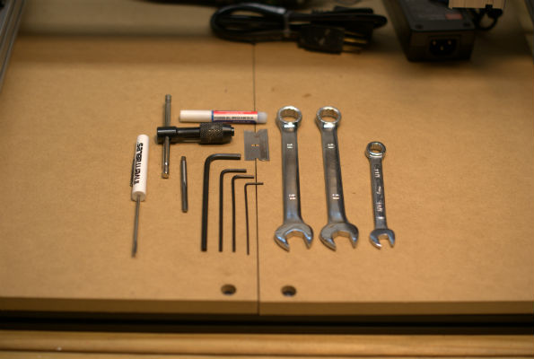

#Pro Tips!

Take your time, read the instructions in their entirety before beginning assembly, and examine all of the the diagrams carefully (the diagrams and most photos are linked to larger versions which will display when one clicks on them, if necessary, examine the relevant .pdf --- see below) until one is confident of how to proceed. Don't force anything, and be careful when tightening not to strip any threads. If things seem to require significant effort, back off, pause and reconsider. Strive for symmetry and alignment while assembling --- while there's no need to "clock" the various bolts and screws, if a part is held in alignment between two elements, it should be evenly spaced between them unless otherwise directed; if a part is supposed to be lined up at one end, make certain that it's aligned vertically and squarely.

The steel plates are laser cut and powder coated. Tolerance for the laser is (roughly) +/- .02mm - .10mm. The thickness of the powder coat is .08mm to .127mm. If the laser errs on the minus side and the powder coating is on the thicker side, it may be necessary to remove the powder coating with a file, sandpaper or other tool.

###Printable .pdfs

There are .pdf versions of the plans/diagrams on [github](https://github.com/shapeoko/Shapeoko_2/tree/master/Drawings_PDF).

###Electronics and Mechanicals

Take a look at the [wiring page](wiring.html) before beginning assembly. Depending on the method you decide to employ, you may have to do some preparatory work for the wiring as you assemble.

The assembly instructions have these two steps separated. The first step is for _testing_ your electronics. As noted in the details of that step, it's easier to troubleshoot, and if there's a major problem, you won't have to disassemble the machine. It is best to partially disassemble the electronics after testing them in order to mount the motors onto the appropriate motor mount carriage plates.

####Pulleys and Shafts

Please note that the pulley attaches with the set screws toward the motor housing and the flat portion at the end of the shaft. Some people have experienced difficulties with the pulley spinning on the shaft --- the GT2 pulleys, with two set screws should be less likely to have this difficulty than the MXL pulleys on the original machine, but one option would be to grind one (or two small flats at 90 degrees to each other) on the shaft, using a fine metal file or sharpening stone (clean up any metal filings afterwards) --- then one would position the pulley so that the set screw(s) engage said flat(s). See the [forums](http://www.shapeoko.com/forum/viewtopic.php?f=10&t=2502&p=18993#p18950) for further discussion. Note that while the set screws should take a 1.5mm hex key, a 1/16", which is slightly larger may also work, and being a snugger fit, will allow for applying more torque.

Be careful of the set screws, they are easily lost (though readily replaced at any hardware store) --- clear your workspace before opening the bag and work slowly and carefully until they're in-place.

###Tools

Only basic tools are required to assemble the Shapeoko 2. The following tools are included with the full kits [sold through inventables.com](https://www.inventables.com/technologies/desktop-cnc-mill-kit-shapeoko-2). If you are rolling your own full kit (you bought the mechanical kit), use the following list as a guideline for [what you will need to assemble the machine](http://www.shapeoko.com/wiki/index.php/Tools).

* Hex Key Set 1.5 / 2.0 / 2.5 / 3.0 / 4.0 mm
* Screw Driver 2.0mm blade
* Wrench 13mm (1/2") Qty 2
* Wrench 8mm (5/16")
* M5x0.8mm Tap and handle (an M8x1.25mm tap may be needed if the Delrin lead nut is too tight)
* Safety glasses
* cable ties (100)
* thread lock --- one can either use this after the fact to secure any nut which begins to loosen, or, if one isn't planning on upgrading the machine, one could use it everywhere (this may make fine-tuning more difficult --- use extra care in the assembly if going that route). An alternative would be to instead use lock washers or replace the nuts with nylon insert lock nuts. Note that thread locker must not be used on the cylindrical portion of the eccentric nuts --- these must be able to rotate to adjust the machine. Thread lock should be used if one has  hex rod and all thread to make up the posts for the Z-axis.
* razor blade (for stripping / cutting wires)

There is one additional item:

* Spiral End Mill

which is intended for use with the machine in the rotary tool once it is fully operational. (You could use it to drill holes in your wasteboard for T-nuts.) Please note that [endmills](http://www.shapeoko.com/wiki/index.php/Endmills) must be considered a consumable item --- it's inevitable that they will wear out (or break!) so one will need an on-going source for them.

Additional useful tools include:

* Pliers
* Wire cutters
* Wire strippers
* 5.5 mm open end wrench for M3 nuts (if using a wiring option which requires them)
* #2 Philips screwdriver (or 9/32" flat-bladed screwdriver)
* Multimeter to test continuity
* Squares to check for squareness or plumb
* pinch sticks to check the assembled machine's diagonals for squareness

----

###Screw Sizes (lengths)

For the most part, it's obvious which size screw is used for what, but the M5 8mm and 12mm BHCS (button head cap screws) are easily confused with the 10mm length --- while it's not noticeable when the shorter 10mm length is used where one ought to use a 12mm, the 8mm and 10mm screws are intended for use with MakerSlide insertion nuts and a screw which is too long and will bottom out before beginning to hold anything in place.

----

###Tapping

Tapping means to cut threads on the inside of a hole.  There is an entire industry based around this process, and some people take it very seriously. If you look around the internet you can find 1,000s of sites with "drill and tap" charts. These charts tell a person how big of a hole is required to be tapped to a certain thread size. There is an article on Wikipedia describing [Tap and Die](http://en.wikipedia.org/wiki/Tap_and_die).

The holes are already formed as part of the extrusion process (as opposed to being drilled) and should be the correct size. If you encounter difficulties, measure the holes. If they are out-of-spec, check on the wiki and forums.

**When tapping, it's important to not just torque down and twist as hard as you can.**

The holes only need to be tapped ~12mm deep for the M5x12mm screws, but may be tapped deeper if using longer bolts. Reserving doing that until upgrading is one strategy.

#####Taps Are Brittle --- Don't drop them on a cement floor.

The tap has to be harder than the material it's tapping. Because of that hardening, it's brittle, as in easily broken. You want to avoid breaking the tap like you would avoid getting the plague. Use a proper tool, such as the T-handle included with your kit, to turn the tap. Don't use a wrench, locking pliers, or a vice. Yeah, those last three will work, but you'll be playing with fire.

#####Lubricate --- a little bit will go a long way.

Lubricating will reduce the amount of friction produced while tapping, making the tap handle easier to turn. It could also aid in chip removal as there will be less friction keeping the chips in. You can use tapping fluid, motor oil, WD-40, butter, PAM, water, etc., or basically anything that's wet. You won't need a lot of whatever you chose. Whatever you choose, be careful to clean it up afterwards, especially if it's water-based which might create the possibility of corrosion, or oily which will stain the wasteboard.

#####Take Your Time --- this is not a race.

No, seriously this is not a race. You don't want to break one of these things. Not only will you be really mad at yourself, but you'll also have to buy a new piece of MakerSlide (or [remove the broken tap mechanically or use kitchen chemistry to dissolve it, see the wiki](http://www.shapeoko.com/wiki/index.php/Makerslide#Breaking_a_Tap)), a new tap, and possibly anything else that you break during your resultant outburst. So, take your time and go slow.

#####You're a Breaker now --- a chip breaker that is.

Take a look at your tap. It's not like a screw where the threads go all the way around the body. There are 4 sections of teeth, separated by vertical gaps called _flutes_. The teeth cut the metal, and the flutes act as an evacuation channel. Yeah, that's right, an evacuation channel. That's bad ass....

Anyway, the flutes keep the chips out of the way so the teeth can keep cutting. Once you feel some resistance, you need to reverse the tap until you feel those chips clear. In some cases (towards the end of the tap) you'll need to reverse it all the way out, clean the tap (just brush off the chips), and then go at it again. The smaller the tap, the easier it is to break. Your tap is an M5 x 0.8mm tap. That's not the smallest tap in the world, but it's not very big either. So, be careful!

The awesome news is that you can hone your tapping skillz (with a z!) by practicing on the Z-axis MakerSlide (the short one that measures 200mm). We only need 1 end of that piece tapped, so if you were to make a mistake while learning, no big deal. Just flip the piece over and use the other side. But, you only get 2 practice holes! Use them wisely. (In theory, one could also practice tapping on the holes at each end of the square aluminum extrusion used for the base.) All of the other pieces of MakerSlide must have all four holes tapped, and those tapped holes will be needed to assemble the machine.

#####What needs tapping?
You need to tap both holes in both ends of each long piece of MakerSlide (4 holes), the short piece for the Z-Axis only needs one end tapped (2 holes). You will have to tap 18 holes in total --- 20 if you do a pair of practice holes in the Z-axis Makerslide, or if you are considering an Acme Z-axis.

Please see the section below and the [wiki link](http://www.shapeoko.com/wiki/index.php/Makerslide) for more information.

---

###MakerSlide

[MakerSlide](http://www.shapeoko.com/wiki/index.php/Makerslide) is a system consisting of:

- 20x40mm aluminum extrusion profile with a built in V-rail
- Delrin "V" wheels that ride on the V-rail
- Plates and hardware to put it together

Extrusion profiles and other CAD data are available at [makerslide.com](http://www.makerslide.com/).

Made of aluminum, it is (relatively) soft and easily dinged or even twisted or bent. Be careful of it, especially the rails. If your rails should become nicked or have a flaw which might damage the V-wheels, use a flat fine file, or emery board or very fine sandpaper attached to a sanding block to remove the protrusion without creating a low depression which would cause problems.

Please check the pieces to ensure that all of them are well-formed --- it should be straight, have squarely cut ends, matching pairs should be the same length, and the holes at the end should be similar diameters.

####Eccentric Nuts

The ShapeOko 2 switches to eccentric nuts from eccentric spacers. These are used to allow adjustment of the V-wheels so that the linear motion for a given axis is constrained to only that axis.

Unlike the original spacers which were held in place by a separate hex nut set off by a washer, they serve a dual-purpose of allowing for adjustment and also holding things together. When adjusting, one must be careful not to loosen things or overtighten --- when making a small adjustment clockwise this is not an issue, but if one must make an adjustment counter-clockwise (or a larger adjustment clockwise) it may be appropriate to use a hex key to to ensure that the M5 bolt rotates to match.

Please check the nuts to ensure that the central hole is off-center.

---

###Workholding

There is a page on [workholding on the wiki](http://www.shapeoko.com/wiki/index.php/Workholding). Since the ShapeOko 2 uses an MDF wasteboard work area, one straight-forward option is to use T-nuts which can then be matched with SHCS which can then be fitted with plastic handles (all available from your local hardware store).

Many projects are suitable for holding down with double-sided tape.

Alternately, Inventables has begun selling a [silk-screened Waste Board with Threaded Inserts](https://www.inventables.com/technologies/waste-board-with-threaded-inserts) and [Clamp Set](https://www.inventables.com/technologies/clamp-set).

---

###Next step [Software](software.html)

To express concerns, post on the [forums](http://www.shapeoko.com/forum/index.php), to suggest improvements without using github, edit [this wiki page](http://www.shapeoko.com/wiki/index.php?title=Tips_1&action=edit&redlink=1).
