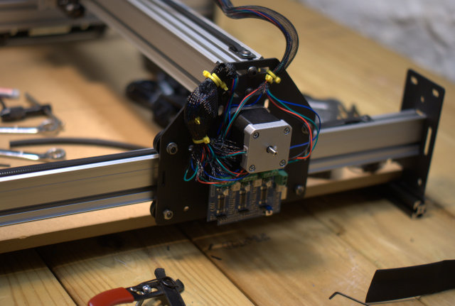

# Electrical Wiring

## Overview

The ShapeOko 2 electrical wiring is, like the rest of the machine, versatile. There are 3 documented options to wire the machine easily. Each option has been broken out into a separate page for clarity. Depending on your setup, and skill set, one option may be better for you than another. Chose your option by evaluating the requirements of your machine, its ultimate size ([if scaling up](http://www.shapeoko.com/wiki/index.php/Scaling_Up)), how you intend to use it and your skill-set and available tools and aesthetic. While the default ShapeOko 2 size can make use of expandable braiding to manage the wiring, you may wish to look at other [cable management options](http://www.shapeoko.com/wiki/index.php/Cable_Management).

If you tested your electronics with terminal blocks it might suffice to merely detach the grey stepper motors from them, but it would probably be better to disconnect them completely and re-strip any leads w/ broken wires.

**Remember, stepper driver chips are fragile and may be damaged by applying power without a motor connected --- always wire things up completely, and verify all connections each time before applying power.**

## Routing

In all scenarios, your stepper wires should be initially be routed as such:

Please note that the Z-axis leads should come down to the X-axis motor mount carriage so as to minimize the wear on the connectors and to begin consolidating the wires.

---

## Option #1 - Soldering
This is the direct wire method that requires (modest) soldering skills to complete (and stepper motors with leads long enough to make a run all the way off the machine). You can assemble the entire machine before doing this step.

###You will need the following tools and parts to complete this option

* Soldering Iron
* Solder
* Wire Strippers
* Heat Shrink Tubing (2 sizes) (or electrical tape)
* Heat source (heat gun or (hair) blow dryer)
* Zip Ties (about a dozen)
* 4 Position Terminal Block (optional)
* Expandable braiding (2 sizes), optional

[click here to view these instructions](wiring_1.html)

## Option #2 - Terminal Blocks

This is the terminal block method. This method is pretty easy, but requires that you make some preparations **WHILE** you are assembling the machine (attaching the terminal blocks). It is best suited for machines which will be scaled up dramatically in size, or for motors which have short leads.

###You will need the following tools and parts to complete this option

* Screw Driver
* Zip Ties
* Expandable Braiding
* Heat shrink tubing
* Heat source (heat gun or (hair) blow dryer)
* 4 Position Terminal Block x 3 pcs.
* 4-conductor wire (shielded, in addition to the 4 color-coded copper conductors there is a steel "drain wire" which may _optionally_ be connected to ground at the controller end, but should be trimmed off with the shielding at the motor end)
* Razor Blade (wire stripper)

The following are used to mount the terminal blocks, but zip ties may be used instead.

* 2.5mm Hex key
* 5.5mm wrench
* M3 x 16mm SHCS x 6 pcs.
* M3 flat washer x 12 pcs.
* M3 hex nut x 6 pcs.

[click here to view these instructions](wiring_2.html)

## Option #3 - Experimental!

This is the 'mount the controller on the machine' method. It's experimental, it's untested, it's **hot**. You can assemble the entire machine before doing this step. If you venture down this path, you're an explorer, and may be on your own. It might be worth it.

###You will need the following to complete this option

* Zip Ties
* Expandable Braiding (2 sizes)
* Razor Blade (wire strippers)
* Bravery & Courage

[click here to view these instructions](wiring_3.html)
