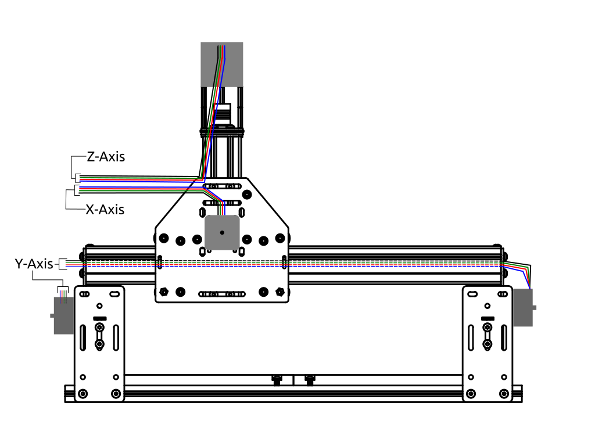

## Option #1

This is the direct wire method that requires (modest) soldering skills to complete. If your motor leads aren't long enough, just splice in and solder more wire. You can assemble the entire machine before doing this step.

###You will need the following tools and parts to complete this option

* Soldering Iron
* Solder
* Wire Strippers
* Heat Shrink Tubing (2 sizes)
* Heat source (heat gun or (hair) blow dryer)
* Zip Ties (about a dozen)
* 4 Position Terminal Block (optional)
* Expandable braiding (2 sizes), optional
* (if your leads aren't long enough) additional wire of the proper gauge and color wrap

##Overview

Your wires coming directly off the stepper motors (these are called leads) will be routed as shown below. In our experience, this is the most effective way to route the leads. However, because you are wielding a soldering iron, feel free to modify these as you see fit. 

###Next Step [Hello, World](/#helloworld)
