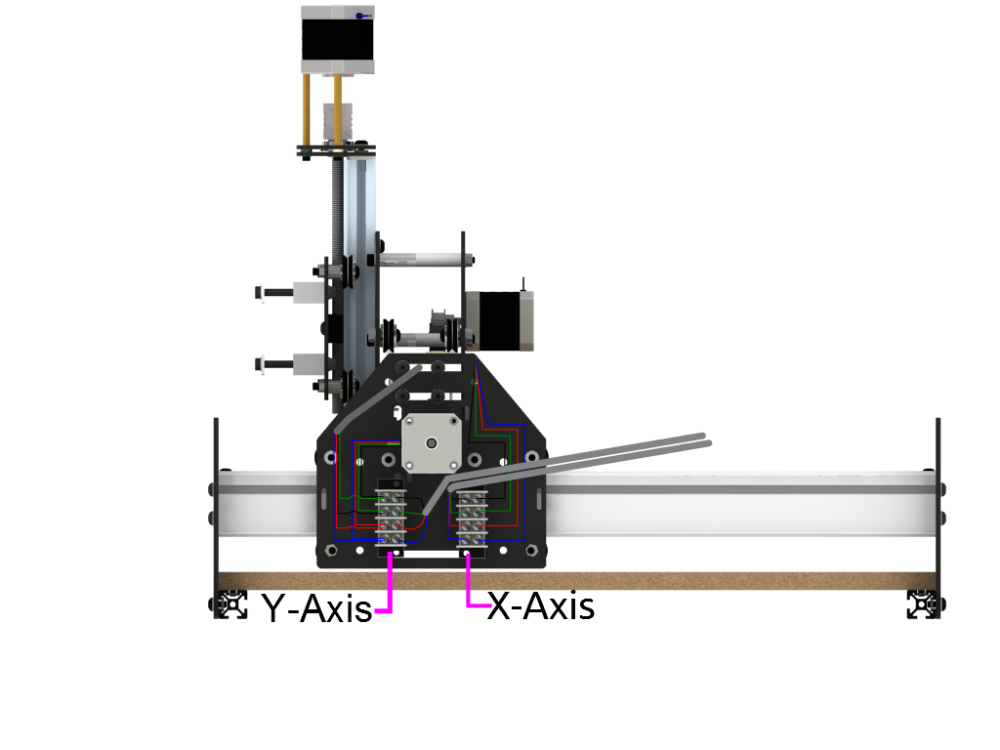

## Option #2
This is the terminal block method. This method is pretty easy, but requires that you make some preperations **WHILE** you are assembling the machine.

###You will need the following tools and parts to complete this option

* Screw Driver (2mm straight)
* 4 Position Terminal Block x 3
* Razor Blade (wire stripper)
* M3 x 16mm SHCS x 6
* M3 flat washer x 12
* M3 hex nut x 6
* Zip Ties
* Expandable Braiding

