## Option #2

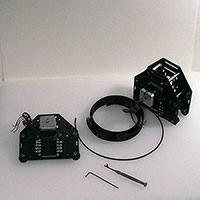
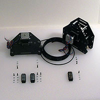
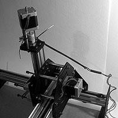
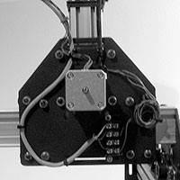
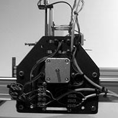
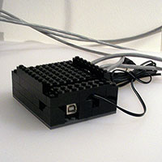
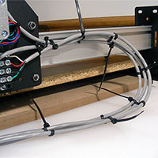
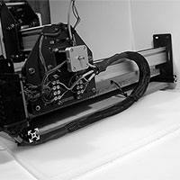

This is the terminal block method. This method is quite easy, but requires that you make some preparations **WHILE** you are assembling the machine (mounting the terminal blocks). It is especially suited if you have short motor leads, or want to expand your machine beyond the reach of your motor leads.

**Note:** The photographs are in greyscale, so as to not influence how one wires things up. Please follow the wiring diagram. The photographs also depict a machine which has its terminal blocks on the right motor mount carriage plate, while the diagrams indicate the blocks should be on the left.

Please mock up your layout and arrangement and make your own decisions about how you want the electronics arranged. Any placement will work, and there are different tradeoffs for all of the possibilites.

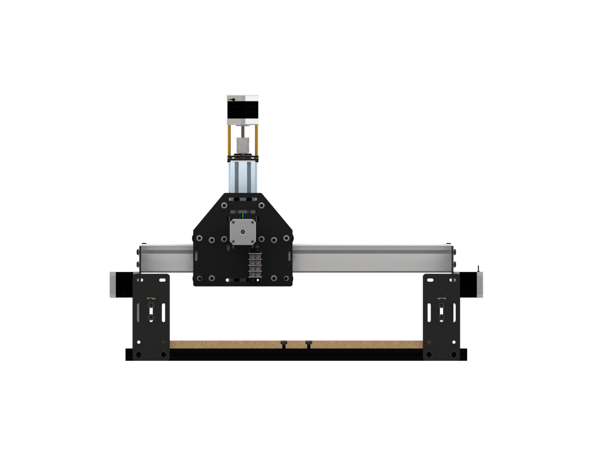

(By elimination, the unlabelled terminal block in the first diagram is for the Z-axis.)

###You will need the following tools and parts to complete this option

####Parts

* 4 Position Terminal Block x 3 pcs.
* Zip Ties
* Expandable Braiding
* Heat shrink tubing (to secure ends of expandable braiding --- zip ties may be used instead)
* 4-conductor wire (shielded, in addition to the 4 color-coded copper conductors there is a steel "drain wire" which may _optionally_ be connected to ground at the controller end, but should be trimmed off with the shielding at the motor end)

You may either use Zip ties, (or foam adhesive strips, or some other technique), or bolts to fasten the terminal blocks to the motor carriages --- if you bolt them you will also need:

* M3 x 16mm SHCS x 6 pcs.
* M3 flat washer x 12 pcs.
* M3 hex nut x 6 pcs. 

You may also need M4 or M5 washers to place in-between the M3 washers and motor mount plates --- these make it easier to keep things aligned and provide a larger surface.

####Tools

* Razor Blade (wire stripper)
* Screw Driver, 2mm straight (for connecting the grey stepper wires to the Arduino)
* Screw Driver, #2 Philips or 9/32" flat (for the combination screws on the terminal blocks)
* a heat source (heat gun or (hair) blow dryer)

The following are needed if securing the terminal blocks with bolts:

* 5.5 mm open end wrench (for the M3 nuts)
* 2.5 mm Hex key (for the M3 SHCS)

[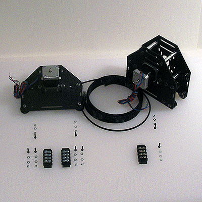](content/tPictures/so_wiring_terminalblocks_parts_8.jpg)

(_Note the above photograph shows some extra bolts, washers and nuts. It also shows a fully assembled Z-axis carriage --- the instructions have one place the terminal blocks on the carriage plate sub-assemblies at the end of the [carriages step](/#carriages)._)

During assembly, attach two terminal blocks to the right Y-axis motor mount carriage and one to the right of the X-axis motor mount carriage. Note the indicated stepper motor orientation, which makes for neater cable runs.

[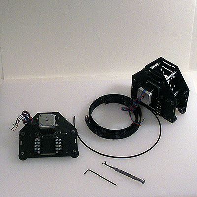](content/tPictures/so_wiring_terminalblocks_tools_8.jpg)

###Z-axis

[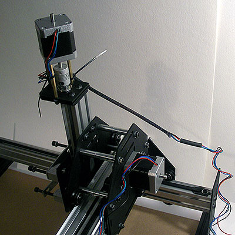](content/tPictures/so_wiring_zaxis_expandablebraid_8.jpg)

After assembly, start at the Z-axis. Raise the Z-axis as high as it will go. Secure the Z-axis lead wire close to the stepper motor to a stand-off to minimize its movement. 

Cut off a length of expandable braiding long enough to reach from the motor stand-offs to the X-axis motor mount carriage plate when the Z-axis is fully raised. Feed the Z-axis motor lead through it, positioning it on the leads so that it can be zip-tied to the stand-offs and mount plate. 

Cut off two ~1" lengths of heat shrink tubing, slide each over the Z-axis leads and the expandable braid, place one piece of heat shrink tubing over either end of the expandable braid. Apply heat to fix them in place over the ends of the braids, then zip-tie each end in place. _Or you can just zip-tie the ends of the expandable braiding._

Re-connect the leads to the terminal block as well as a grey 4-conductor wire (see the [Electronics page](/#electronics) for details). Arrange and secure any excess length of the Z-axis leads, arrange and zip-tie the Z-axis stepper motor wire off the top of the right side of the X-axis plate. 

If your wire has not yet been cut to length, read ahead in the directions and loosely zip tie it along the complete route, test the movement of the machine and then cut it to (a little longer than) length, allowing for stripping off the cover, shielding and wire ends and making the connection to the Arduino. Repeat this with the other two axis wires.

###X-axis

[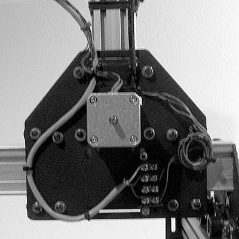](content/tPictures/so_wiring_gantry_zaxis_terminalblock_8.jpg)

Move the X-Z-sub-gantry to the left of the gantry. 

Zip-tie the X-axis leads close to the stepper motor to the carriage plate to minimize its movement, orienting it towards the Z-axis stepper motor wire. 

Arrange the stepper motor wire in an even arc leading to the right Y-axis motor mount plate. Zip-tie the leads to the wire until you reach the mount plate (alternately, use expandable braiding if you have a suitable size and length). Zip-tie the Z-axis stepper motor wire to the plate near the Makerslide and arrange it towards the rear of the machine.

Re-connect the X-axis leads to the  right-most terminal block as well as a grey 4-conductor wire. Arrange and secure any excess length of the X-axis leads, arrange the X-axis stepper motor wire towards the rear of the machine.

###Y-axis

[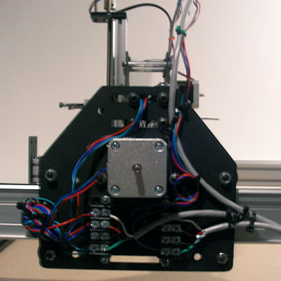](content/tPictures/so_wiring_x_y_terminalbocks_8.jpg)

Thread the left Y-axis stepper motor leads through the top slot of the mount plates and through the MakerSlide to the right gantry plate, Zip-tieing it where it passes through each slot.  

Twist the leads together with the leads from the right Y-axis motor (remember to reverse one pair of wires) and connect them to the terminal block. 

Bundle and secure the excess leads. Connect the Y-axis stepper motor wire to the terminal block and arrange it towards the rear of the machine. Zip-tie it in place at the rear of the plate. Zip-tie it and the other stepper motor wires together.

###Arduino

Please note the following was done to a machine which had its wasteboard inverted (flipped to the bottom) and a second wasteboard added --- there may not be clearance underneath the carriage on a stock machine unless one re-locates the exit of the wiring bundle from the Y-axis plate higher than is shown above.

[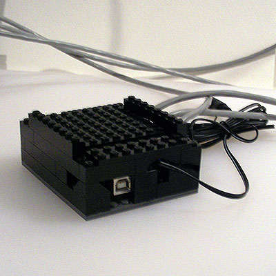](content/tPictures/so_enclosure_legobricks_8.jpg)

Arrange the stepper motor wires so that they reach the Arduino. 

[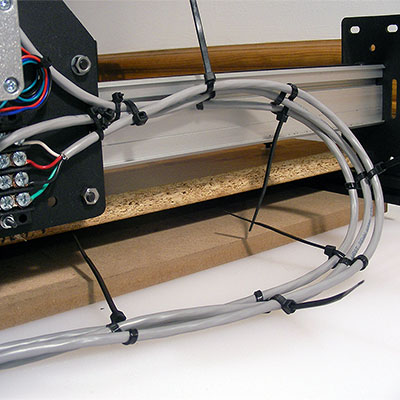](content/tPictures/so2_w2_xyz_wires_ziptied_8.jpg)

Zip tie the wires together (one can persuade them to lay flat by weaving the tie under, over, under, back around, under, then over and close it as shown, or you can loosely zip tie the bundle together, insert one zip tie in-between each set of wires, securing the first zip tie tightly, then tighten the initial zip tie --- place zip ties every couple of inches to hold things securely). Move the gantry to the back and arrange the wires in a gentle run to the controller. Measure a length of expandable braiding to cover the wires from the gantry to the controller. Label the ends and cover the wires with the expandable braiding. Cut off two lengths of heat shrink tubing, slip them over the wires and braiding, covering the cut ends of the braiding and heat them to seal the ends. 

[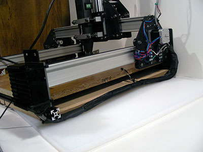](content/tPictures/so2_w2_xyz_cable_extended_8.jpg)

[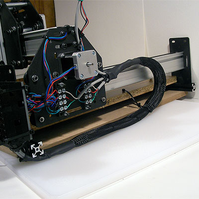](content/tPictures/so2_w2_xyz_cable_coiled_8.jpg)

If the Arduino will be mounted to the machine you may wish to zip tie the wiring bundle at a bit more than the half-way point of the machine.

Re-connect the wires to the Arduino per the wiring diagram and zip tie them in place. Check all the wiring, moving the machine carefully through its range of X- and Y-axis motion, ensuring nothing works loose. If you have access to a multimeter, use it to check the continuity of the wiring before connecting, powering up and testing or using the machine.

If desired, fashion an enclosure and mount it to the machine. 

Jog each axis, checking the direction and distance of the machine's movement. If any movement is in the wrong direction, reverse a pair of wires at the Arduino or reconfigure Grbl (the specific values for doing so are in the next section). If movement is more or less than expected, check the gShield micro-stepping jumpers for that axis --- if necessary re-calculate Grbl's settings.

If any aspect of your machine doesn't function properly, see the wiki pages [assembly troubleshooting](http://www.shapeoko.com/wiki/index.php/Assembly_troubleshooting) and [fine tuning](http://www.shapeoko.com/wiki/index.php/Tuning).

###Next Step [Hello, World](/#helloworld)

To express concerns, post on the [forums](http://www.shapeoko.com/forum/index.php), to suggest improvements without using github, edit [this wiki page](http://www.shapeoko.com/wiki/index.php?title=Wiring_2_1&action=edit&redlink=1).
