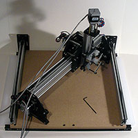
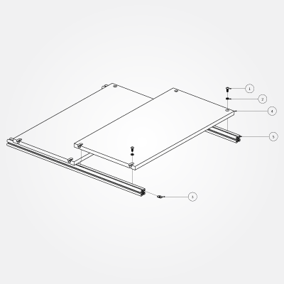
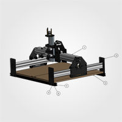
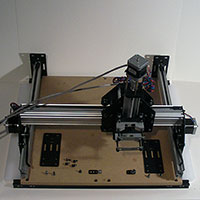
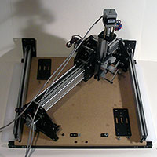
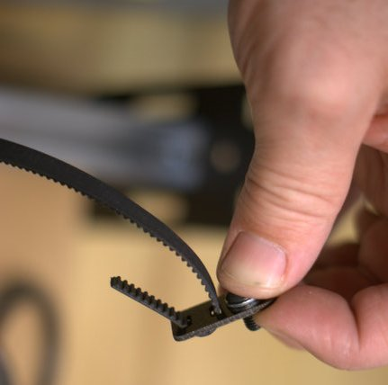
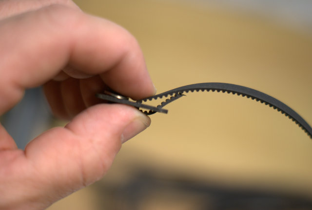

# Work Area

## Overview

The final assembly will be assembled, then the balance of the machine put together and mounted on it.

##Waste Board Assembly (PS20024)

 

1. 25286-02 **M5 x 12mm, BHCS** x 8 pcs.
- 25287-02 **M5 Flat Washer** x 8 pcs.
- 26016-01 **M5 insertion nut** x 8 pcs.
- PS20001 **MDF wasteboard** (1/2") x 2 pcs.
- PS20009 20mm x 20mm x 550mm **aluminum extrusion, black anodized** x 2 pcs.

Start with the captive nuts in the holes (shown in the back right of the diagram). 

- Place a washer (**\#2**) on a bolt (**\#1**)
- slide the bolt into a hole in the wasteboard (**\#4**)
- thread on an insertion nut (**\#3**)
- then slide the aluminum extrusion (**\#5**) onto the bolt and insertion nut. 
- Repeat until all the holes are filled

Repeat the above process with the slots, but instead assemble the bolt, washer, nut combinations, slide them into the aluminum extrusion, then slide the extrusion onto the wasteboard.

Carefully center and square everything up, then tighten the bolts. Square up the wasteboard assembly carefully, since it will be the foundation for the balance of the machine.

## Assemble the Frame

###Parts

1. PS20025 **Complete Gantry** x 1 pcs.
- PS20026 **Y-Axis Rail Assembly** x 2 pcs.
- PS20024 **Waste Board Assembly** x 1 pcs.
- 8 25286-01 **M5 x 10mm, BHCS** x 8 pcs.
- 8 26016-01 **M5 insertion nut** x 8 pcs.
- 8 25287-02 **M5 Flat Washer** x 8 pcs.

Place the 10mm M5 bolts (**\#4**) with washers (**\#6**) into the bottom holes on the open end plates which are attached to the MakerSlide, thread on the insertion nuts (**\#5**), then carefully slide the rail assemblies (**\#2**) onto the wasteboard extrusion. Tighten the bolts enough to be certain the threads won't pull free.

Turn the eccentric nuts on the V-wheels on the Complete Gantry (**\#1**) so that they are as far from the static V-wheels as is possible. Drive the Complete Gantry onto the two Y-Axis Rail Assemblies (PS20026), then attach the open end plates.

Tighten the bolts holding the MakerSlide, then begin tightening the bolts which hold the bottom of the open end plates. Carefully center the Y-axis rails and gantry on the wasteboard. Move the gantry to one end and continue tightening the bottom bolts. Move the gantry to the other end, then repeat. Go back and forth gradually tightening things and ensure that everything is aligned and square and that the gantries move freely.

Check the alignment with a known-to-be-good square. One can also measure the diagonals to test for squareness. Ensure that everything is aligned squarely and that the Complete Gantry and the X-Axis Sub Gantry move smoothly. Finish tightening the bolts. (These last steps are covered in more detail below under Fine-tuning below).

Congratulations! You've built a ShapeOko!

## Fine-tuning

### Squaring the Machine

Check that each component is square to the others using a known-to-be-good square. If you don't have a square, measure the diagonals and compare the distances. Loosen bolts, adjust and re-tighten as needed until everything is true and moves linearly.

### Adjusting the V-Wheels

At this point, you will need to adjust the machine's V-wheels. These should be tight enough to hold things in alignment, but loose enough that the machine moves freely and smoothly. The suggested technique for this is, "Loosen the eccentric spacer until the V-wheel does not rotate when the carriage is moving and then tighten just (and no more!) until the V-wheel rotates when moving the carriage. Overtightening will lead to the V-wheel wearing out."

* Slide the gantry back and fourth a couple of times to even out the rails and get everything roughly lined up. It may still feel stiff when sliding, but you can adjust that later.
* Slide the gantry to the back of the machine. Both V-wheels should be touching or at least be the same distance from the belt anchors. Carefully snug up the four screws on the back end plates.
* Gently slide the gantry to the front of the machine. Both V-wheels should be touching or at least be the same distance from the belt anchors. Carefully snug up the four screws on the front end plates.
* Slide the gantry back and fourth a couple times to see if anything is askew. **Note:** It may be tough to move your gantry, almost as if it is binding, this is fine as you'll adjust that in the next set of steps. 

####Steps for Silky Smooth Motion

1. Make certain that the four V-Wheels that are mounted with the eccentric nuts are loose. You should notice some slight play once loosened.
2. Slide the gantry back and fourth. It should feel as if it is gliding freely and smoothly. Remember how this feels as this is what we are striving to reach.
3. Taking one V-Wheel at a time, adjust the eccentric spacer and fully tighten it. Slide the gantry back and fourth, is it still how it felt from step 2? If yes, then move on to step 4. If no, then repeat this step until you achieve smooth, gliding motion.
4. Repeat step 3 until all V-Wheels are properly adjusted. 

## Mount the Belts

You should now mount the belts on the belt anchors.

* Divide the belt into thirds (one-third for the X-axis, two equal lengths for the two sides of the Y-axis)
* Loop the belts into the belt anchors
* Tighten one end of each belt
* Use some technique which allows you to tension the other end of each belt and tighten it down (see below). 

The belts get routed through the belt clips by:

1. Passing the belt **down** through the __back__ slot (closest to the screw).
2. From the back slot, they go down, and then back **up** through the front slot.
3. You only need about 12mm (1/2") of belting through the front slot to lock the loops together.
4. Making sure the teeth mesh together will ensure a tight (slip free) fit.

##Tighten the belt

With the Allen wrench inserted into the button head cap screw, adjust the screw so it's **almost** tight. Then, gripping the Allen wrench, pull it back towards the end plate so it's very tight, once it's tight, rotate the Allen wrench clockwise to finish tightening the screw. Like so:

(If you can't get enough tension, place one of the 13mm wrenches against the far side of the Allen wrench and use it as a handle to pull the Allen wrench to pull the belt anchor to tension the belt)

###Next Step [Wiring](wiring.html)
