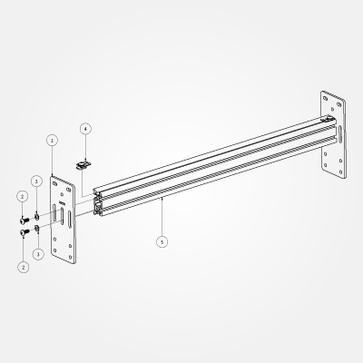

# End Plates

##Y-Axis Rail Assembly (PS20026)

**Note:** The remaining two pieces of MakerSlide must have threads in it, cut by tapping. If you have not yet finished tapping your MakerSlide, you can put this off no longer.

### Overview

 

**Note:** Although the assembly photo shows both end plates attached, only attach one to each Y-axis rail at this time.

### Requirements

####Parts

1. **End Plate** (12ga) 26028-01 x 2 pcs.
* **M5 x 12mm, BHCS** 25286-02 x 4 pcs.
* **M5 Flat Washer** 25287-02 x 4 pcs.
* **Belt Clip Assembly** PS20020 x 4 pcs.
* X/Y Axis Rail - **MakerSlide Extrusion - 500mm** PS20008 x 2 pcs.

Slide two Belt Clip Anchor Assemblies (**\#4**) into the top slot of the MakerSlide (**\#5**).

Attach one end plate (**\#1**) to each piece of MakerSlide using the 12mm M5 bolts (**\#2**) and M5 washers (**\#3**).

Do not attach the second end plate, that will be done in the next step.

###Next Step [Work Area](http://docs.shapeoko.com/workarea.html)

To express concerns, post on the [forums](http://www.shapeoko.com/forum/index.php), to suggest improvements without using github, edit [this wiki page](http://www.shapeoko.com/wiki/index.php?title=Yaxis_1&action=edit&redlink=1).
