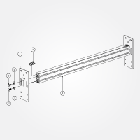
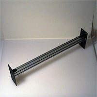
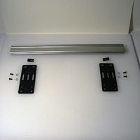
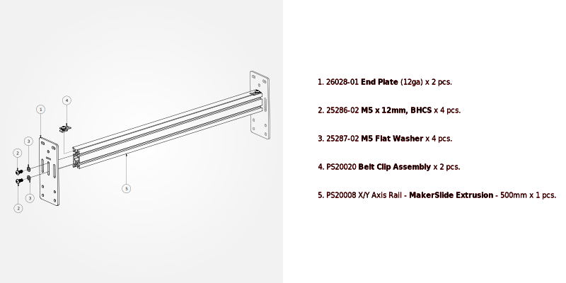

# End Plates

##Y-Axis Rail Assembly (PS20026)

**Note:** The two pieces of MakerSlide used in the following steps must have threads in them, cut by tapping. If you have not yet finished tapping your MakerSlide, you can put this off no longer.

### Overview

 

**Note:** Although the assembly photo shows both end plates attached, only attach one to each Y-axis rail at this time.

### Requirements

####Parts

1. 26028-01 **End Plate** (12ga) x 4 pcs.
* 25286-02 **M5 x 12mm, BHCS** x 8 pcs.
* 25287-02 **M5 Flat Washer** x 8 pcs.
* PS20020 **Belt Clip Assembly** x 4 pcs.
* PS20008 X/Y Axis Rail - **MakerSlide Extrusion - 500mm** x 2 pcs. (Note, the MakerSlide must have M5x0.8 threads tapped in all holes)
 
(You will need to assemble two PS20026 Y-Axis Rail Assemblies)

Slide two Belt Clip Anchor Assemblies (**\#4**) into the top slot of the MakerSlide (**\#5**).

Attach one end plate (**\#1**) to each piece of MakerSlide using the 12mm M5 bolts (**\#2**) and M5 washers (**\#3**). Place what will be the top of each piece of Makerslide at the top of the channel --- the top of the MakerSlide should flush with the bottom of the horizontal slot (the two assemblies will have a slight mirror-imaged asymmetry).

Do not attach the second end plate, that will be done in the next step.

###Next Step [Work Area](/#workarea)

To express concerns, post on the [forums](http://www.shapeoko.com/forum/index.php), to suggest improvements without using github, edit [this wiki page](http://www.shapeoko.com/wiki/index.php?title=Yaxis_1&action=edit&redlink=1).
