# Z-Axis Assembly

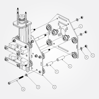
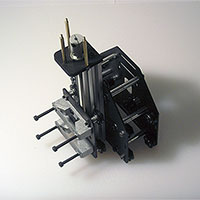
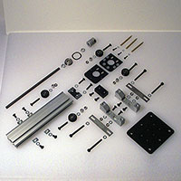
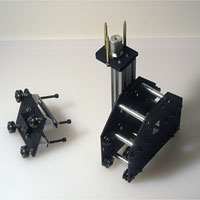
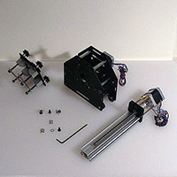

The Z-axis assembly is comprised of several sub-assemblies. When assembling it, it is best to select a Motor Mount Carriage (PS20022) which already has a stepper motor in place.

**Note:** You will need to have at least your Z-axis MakerSlide tapped before completing this step. It is probably best to begin tapping well in advance of needing parts, so as to ensure that one works slowly, carefully and patiently at tapping, especially if one initially lacks experience at it.

##Z Assembly Carriage (PS20021)

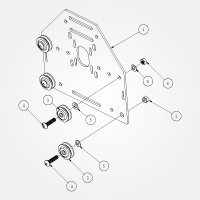

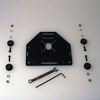

###Requirements

####Parts

1. 26029-01 **Motor Mount Plate** (12ga)
- 30158-01 **Eccentric Nut** x 2 pcs.
- 25203-02 **Dual Bearing V-Wheel (assembly)** x 4 pcs.
- PS20004 **M5 x 20mm BHCS** x 4 pcs.
- 25287-02 **M5 Flat Washer** x 6 pcs.
- 25284-02 **M5 Hex Nut** x 2 pcs.

This is the plate the Z-axis will attach to (it is identical to the Motor Mount Carriage (PS20022) assembled in the previous step, but without smooth idlers. It sits on the front of the gantry and will be connected to the X-axis motor mount plate via rigid aluminum spacers. We will build the plate first, and then attach the two together.

[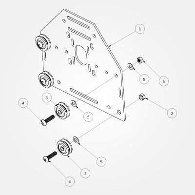](content/tPictures/PS20021_16.png)

 - Connect V-Wheels (**\#3**) to the plate (**\#1**)
	- two static at the top (using M5 Hex Nuts (**\#6**))
	- two eccentric at the bottom in the larger holes (using Eccentric Nuts (**\#2**))

##Spindle Carriage Assembly (PS20029)

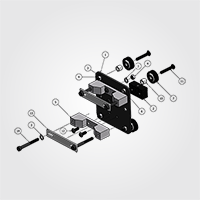

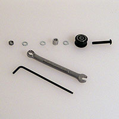

###Requirements

####Parts

1. 30287-01 **Spindle Mount Plate** (12ga) x 1 pcs.
- PS20010 13mm x 35mm x 20mm **Delrin Lead nut** x 1 pcs.
- 25287-02 **M5 Flat Washer** x 10 pcs.
- 25284-02 **M5 Hex Nut** x 6 pcs.
- PS20012 **Universal Spindle Mount** x 2 pcs.
- 30158-01 **Eccentric Nut** x 2 pcs.
- 25203-02 **Dual Bearing V-Wheel (assembly)** x 4 pcs.
- 25196-01 5mm x 16mm x 5mm Bearing (x 8 pcs. *contained in #7. above*)
- 25201-01 Precision 1mm spacer (x 4 pcs. *contained in #7. above*)
- 25312-14 3/8" x 5/16" x #12 bore, **Aluminum Spacer** x 4 pcs.
- 25286-05 **M5 x 30mm, BHCS** x 4 pcs.
- 25286-02 **M5 x 12mm, BHCS** x 6 pcs.
- PS20013 **Universal Spindle Mount strap** x 2 pcs.
- PS20005 **M5 x 45mm, SHCS** x 4 pcs.

Place the V-wheels (**\#7**) and the Delrin Lead nut (**\#2**, for the Z-axis Rail Assembly, see below) on one side of the Spindle Mount Plate (**\#1**) and the Universal Spindle Mount (**\#5**) and Straps  (**\#13**)on the other. The Eccentric Nuts (**\#6**) go in the larger holes. **Note:** Be certain to use the aluminum spacers (**\#10**) which set this plate off from the Z-axis rail assembly, allowing room for the threaded rod) and ensure that all V-wheels are vertically aligned with each other (be careful of washer placement/order).

##Z-Axis Rail Assembly (PS20028)

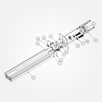
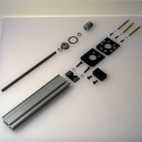
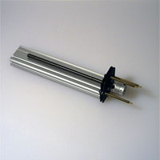

**Note:** The above exploded view does not show the wavy washer (PS20017) which goes on top of the flanged bearing.

One should also attach the motor for the Z-axis at this time.

###Requirements

####Parts

1. 25142-07 Z Axis **Rail MakerSlide Extrusion 200mm** x 1 pcs.
- 25772-02 Z-Axis **Flexible Coupler 5mm--8mm bore** x 1 pcs.
- 30288-01 **Z-Axis Motor Mount Plate** (12ga) x 2 pcs.
- 30169-01 8x22x7mm **flanged bearing** x 1 pcs.
- 30289-01 **Z-Axis Shim Plate** (12ga) x 1 pcs.
- PS20011 **M8 Threaded Rod Stainless Steel, 200mm** x 1 pcs.
- 25287-02 **M5 Flat Washer** x 2 pcs.
- PS20014 **Brass Standoff spacer** M3 male x M3 female 50mm x 3 pcs.
- PS20016 5mm x 10mm x 1mm thick, **Nylon Spacer** x 4 pcs. (these are used for the M5 BHCS (#10. below) which hold the Z-Axis Motor Mount Plate to the MakerSlide)
- PS20004 **M5 x 20mm BHCS** x 2 pcs.
- PS20015 3mm x 8mm x 1mm thick, **Nylon Spacer** x 6 pcs. (these are used with the M3 SHCS (#12. below) which attach to the Brass Standoff spacers)
- 25285-10 **M3 x 12mm, SHCS** x 3 pcs.
- 25287-03 **M3 Flat Washer** x 3 pcs. 
- PS20007 **M8, Hex Nut** x 2 pcs.
- PS20017 **Wave Disc Spring**, .901"ID, 1.159" OD, .013" thickness (please note that this is *not* shown in the diagram, it is placed on top of the flanged bearing)

####Electronics

- **Stepper Motor** (if at all possible, you should attach the stepper motor at this time, doing it later will probably require some disassembly)
- 25287-03 **M3 Flat Washer** x 3 (or more, see below) pcs.

####Tools

 - 13mm (or 1/2") open end wrenches x 2 pcs.
 - M3 Hex Key (for the M5 BHCS)
 - M2.5 Hex Key (for the M3 SHCS and coupler set screws)
 - 5mm open end wrench, adjustable crescent wrench or pliers (ideally nylon-jaw parallel) to tighten the M3 brass standoffs

**Note:** Depending on how deeply tapped on the stepper motor and how long the threads are on the brass standoffs, it may be necessary to add additional M3 washers when attaching the motor using the brass standoffs.

[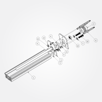](content/tPictures/PS20028_16.png)

Assemble this from the inside out, starting with the smallest pieces. 

1. Take one Z-Axis Motor Mount Plate (**\#3**, this will become the bottom)
- place M3 washers (**\#13**) onto the 12mm M3 screws (**\#12**) and place them in the appropriate holes
- stack the Nylon Spacers (PS20015) (**\#11**) onto the screws
- place the Wave Disc Spring (**\#15**, not shown in the diagram) onto the narrow part of the flanged bearing (**\#4**) --- it would be to the right in the diagram
- insert that into the second Z-axis Motor Mount Plate (**\#3**)
- insert the two M5 bolts (**\#10**) and M5 washers (**\#7**) from the other side
- add the last two Nylon Spacers (**\#9**) to the bolts and slide the top and bottom Z-axis Motor Mount Plates together
- Loosely thread on the M3 Brass Standoff spacer (**\#8**) onto the M3 screws
- Place the Z-axis Shim Plate (**\#5**) on top of the Z Axis Rail  (**\#1**, 200mm MakerSlide) and attach it using the M5 bolts

####Threaded Rod

[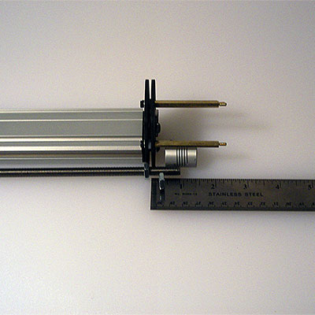](content/tPictures/so_z_axis_dimensions_8.jpg)

**Note:** Check your rod's straightness (one way is by rolling it on a flat surface) before assembly and check to see that the threaded rod runs smoothly on the Delrin Lead nut --- if it doesn't, run the nut along the rod until it does. Using a drill is one option. Be certain the nut is free of debris or other materials. 

Compare the threaded rod (**\#6**) to the assembly thread on one M8 Hex Nut (**\#14**) threading the latter far enough down to allow room for the flanged bearing, a second hex nut and for the threaded rod (and the stepper motor shaft) to be just short of half-way into the flexible coupler (**\#2**). Insert the threaded rod into the bearing, add the second M8 hex nut and tighten them with two wrenches, being careful not to bend the rod. 

Tighten the coupler set screw holding the threaded rod using the 2.5mm hex key. If the flexible coupler doesn't securely grip the threaded rod, wrap the end of the rod in some sort of metal foil or tape to ensure coupler holds it securely. Make certain the coupler holds the rod squarely.

####Stepper Motor

If possible, attach the stepper motor, place M3 washers on the brass M3 standoffs --- if the standoffs bottom out, add sets of M3 washers to ensure the threads are well-engaged and not bottoming out. Ensure that the motor shaft will also fit just short of half-way into the flexible coupler and that the rod and motor shaft have a gap which will allow the flexible coupler to function without interference or binding. Tighten the coupler set screw holding the motor shaft using the 2.5mm hex key.

Tighten everything.

###Z-Axis

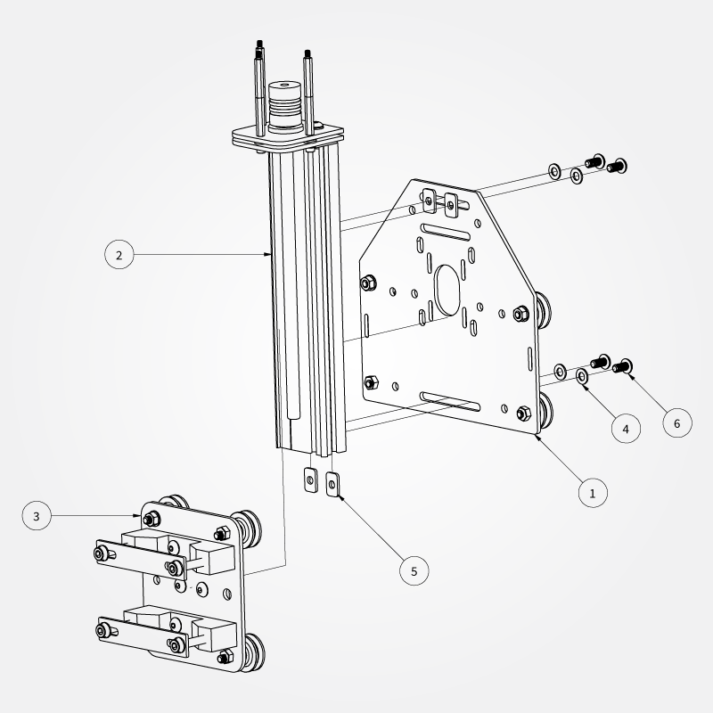
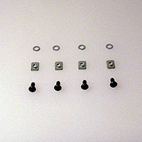

1. PS20021 **Z-Assembly Carriage** x 1 pcs.
- PS20028 **Z-Axis Rail Assembly** x 1 pcs.
- PS20029 **Spindle Carriage Assembly** x 1 pcs.
- 25287-02 **M5 Flat Washer** x 4 pcs.
- 26016-01 **M5 insertion nut** x 4 pcs.
- 25286-01 **M5 x 10mm, BHCS** x 4 pcs.

Insert the 10mm M5 bolts (**\#6**) with an M5 washer (**\#4**) into the Z-Assembly Carriage (**\#1**) from the side the V-wheels are on, thread on the M5 insertion nuts (**\#5**), then slide the MakerSlide of the Z-Axis Rail Assembly  (**\#2**) onto the nuts, align and center the assemblies and tighten.

[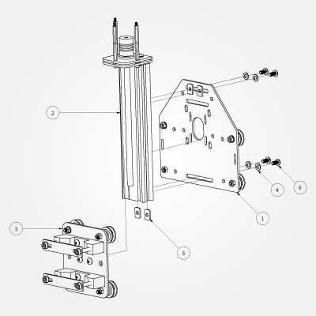](content/tPictures/PS20030_16.png)

Turn the eccentric nuts on the Spindle Carriage Assembly (**\#3**) so that they move the matching V-wheels as far as possible from the opposing static V-wheels. Slide the Spindle Carriage Assembly onto the Z-Axis Rail Assembly, match it up with the Delrin Lead nut and turning the threaded rod using the flexible coupler, bring the Spindle Carriage Assembly up so that the V-wheels are completely on the MakerSlide V-rail. Be careful not to nick or damage the Delrin V-wheels, or to cross-thread the Delrin Lead nut.

##Sub Gantry (PS20023)

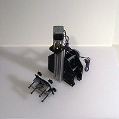

###Requirements

####Parts

1. PS20021 **Z-Assembly Carriage** x 1 pcs.
- PS20022 **Motor Mount Carriage** x 1 pcs.
- PS20002 3/8" x 1-1/4" x #12 bore, **Aluminum Spacer** x 6pcs.
- PS20006 **M5 x 70mm SHCS** x 6 pcs.
- 25287-02 **M5 Flat Washer** x 12 pcs.
- 25312-20 3/8" x 1" #12 Bore, **Aluminum Spacer** x 6 pcs.
- 25284-02 **M5 Hex Nut** x 6 pcs.
- PS20030 **Complete Z-Axis Assembly** x 1 pcs. (not enumerated in the diagram)

If possible, select a Motor Mount Carriage (PS20022) which has a stepper motor attached. If using wiring option #2, there should be a terminal block attached to the right (on the side opposite the V-wheels and smooth idlers).

[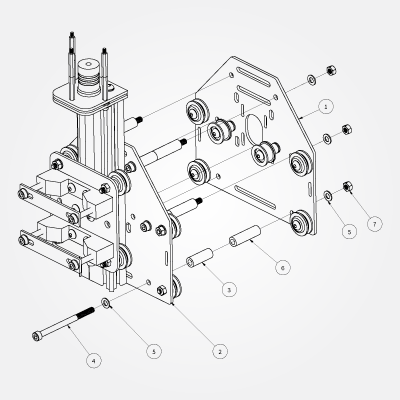](content/tPictures/PS20031_16.png)

Place washers on the M5 x 70 mm SHCS (**\#4**) and place them in the outer holes of the Z-Assembly Carriage (**\#1**) from the side opposite the V-wheels. Place one each of the Aluminum Spacers (**\#3**,  and **\#6**) on each bolt, place the Motor Mount Carriage (**\#2**) onto the bolts and attach using an M5 washer (**\#5**) and M5 hex nut (**\#7**).

[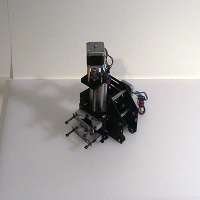](content/tPictures/so_carriage_8.jpg)

[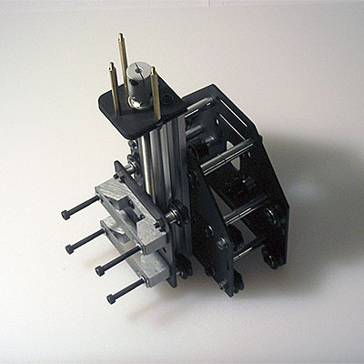](content/tPictures/so_gantry_carriage_8.jpg)

###Next Step [Gantry](http://docs.shapeoko.com/gantry.html)

To express concerns, post on the [forums](http://www.shapeoko.com/forum/index.php), to suggest improvements without using github, edit [this wiki page](http://www.shapeoko.com/wiki/index.php?title=Zaxis_1&action=edit&redlink=1).
