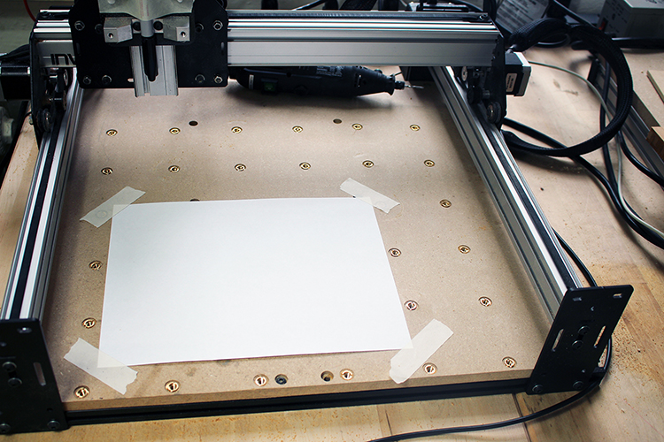
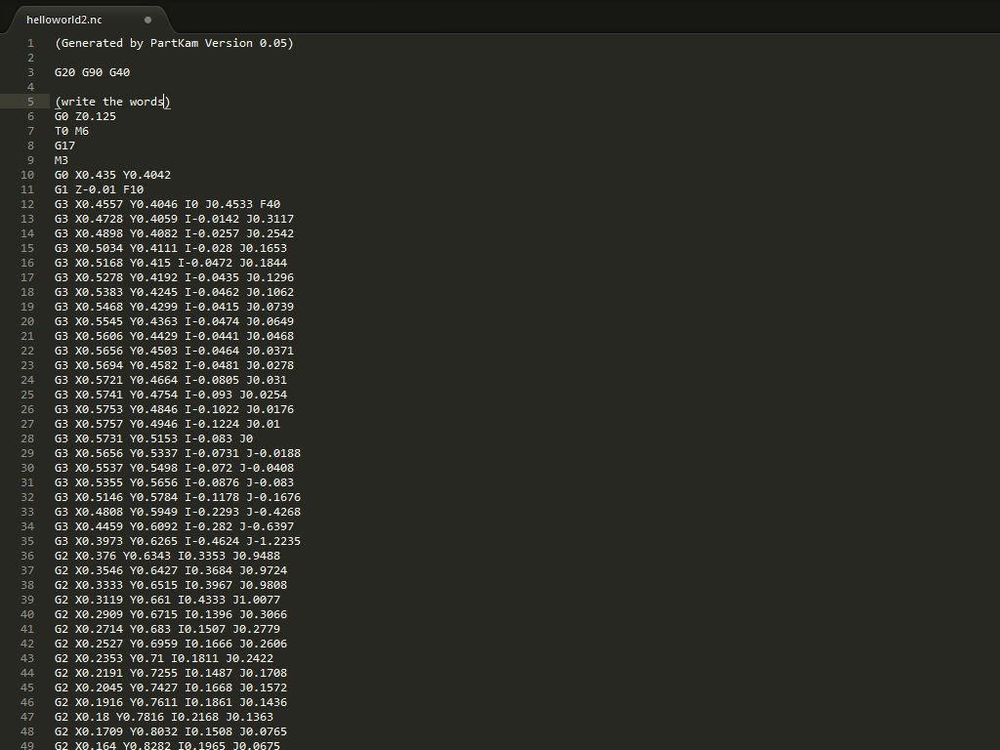
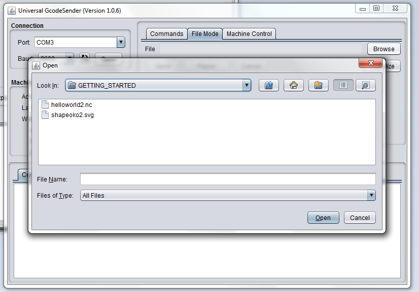
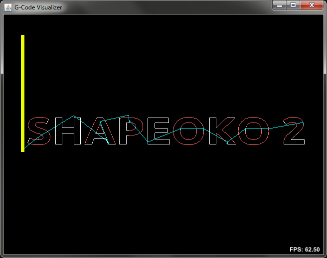
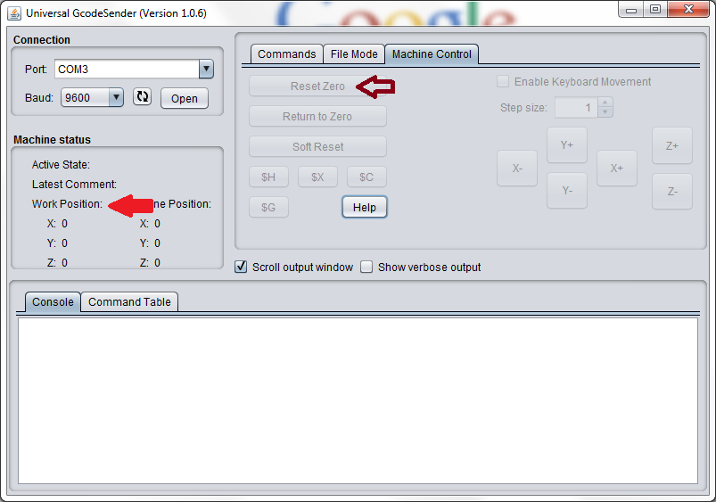
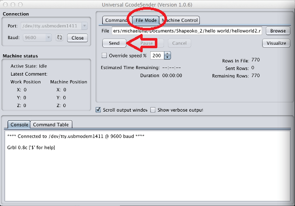

##Getting Set Up
At this point, we should have a fully assembled machine, capable of making amazing things. BUT, first, we need make sure everything is in good working order. Our first order of business is to ensure that our firmward (grbl) is configured correctly. To do this, we need to open UGS (universal gcode sender), and check a couple of parameters. 

#####Open UGS, and connect to your machine

#####Under the 'commands' tab, type $$ (yep, two consecutive dollar signs) into the text box, and then press enter. At the bottom of your screen, grbl will send back a bunch of information to your screen. 

#####The _only_ values we are worried about right now are the steps/mm settings.
These tell your machine how many steps it takes your motors to move the machine 1mm. Don't worry about any of the other settings. Also, don't worry about doing the math to figure out the answer. We have already done that for you. The proper values should read:

	$0 = 40.02
	$1 = 40.02
	$2 = 320

#####If those are correct, then proceed to the next step (pre-flight) in the process. 

If they are not correct, it's very simple to fix:

	* Put your cursor in the command textbox (the same place you typed $$ earlier)
	* type $0=40.02 then press the enter button
	* type $1=40.02 then press the enter button
	* type $2=320 then press the enter button

That was easy wasn't it! Now proceed to the next step.

##Pre-Flight
Now that we have that taken care of, we are going to run a job, that we in the Shapeoko community call "Hello, World". When it's finished, it will look like this:

---

Before we begin, let's make sure we are ready to go:

* Electronics tested?
* Machine Assembled?
* Software Installed?
* firmware verified?
* Work area cleaned up?

If you answered yes to all 4 questions above, then let's proceed.

##Work Area
Tape a piece of paper down to your work area. The paper should be taped in landscape orientation (wider than it is tall). Keep the paper towards the front/left of the machine.

##Download Files
Download [this file]("helloworld2.nc")and save it somewhere to your computer that you will remember, like the desktop or your Documents folder.

##Position Machine
With the machine turned off, move your gantry to the front left corner of the paper that we taped down in step \#1.

##Position Sharpie
Lower your sharpie so it is _just_ barely above the paper.

##Open Software
Turn the power on to your machine and Open Universal Gcode Sender on your computer. Once the program has loaded, connect to your machine.

##Open File
Browse for the file you downloaded in step #1 and open it.

##Verify File
Click the visualize button, located just below the browse button, to see what the file will look like. A screen similar to the one below will display after a few second. You can interact with this screen by left clicking and dragging your mouse around. The depth of this file is very shallow (.01"), so there is not much to look at beyond the general shape of the output. If the file were deeper, those levels would be represented as layers in the visualizer.

##Set Zero
If your file visualization looks correct, close the visualizer and click the 'machine control' tab towards the top of the window.

Click the 'Reset Zero' Button, to tell your machine that you are at 0,0. You should notice on the left of the panel your work position coordinates will be set to X:0, Y:0, Z:0

##Run Job!
Now, click the 'File Mode' tab at the top of the program window. OK, now we're ready. Take a deep breath (this is going to be amazing) and click the 'Send' button just below the file path.

##Rule World!
Your machine will now run the hellow world job. Keep close to your computer, and be aware of how to quickly disconnect the power from your machine in case of an emergency situation.

